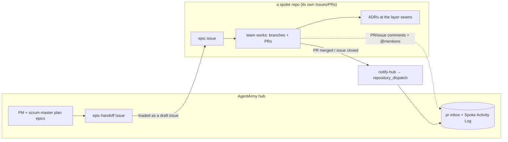

# Agent Collaboration (cross-repo)

How the armies and teams work together across the **hub** (AgentArmy) and the **spoke**
repos (frontend-core, middle-core, backend-core). The spokes run isolated microVM agents
that can't reach each other or the hub directly — so collaboration happens through a few
deliberate, low-friction channels.

!!! tip "The one-liner"
    Work is **handed down** as issues, **done** as PRs in each spoke, **discussed** in PR/issue
    comments, and **reported back** to the hub by an event. Decisions are captured as **ADRs**.

## The interaction channel: PR & issue comments

The primary back-and-forth between the hub and a spoke team is **comments on the PRs and
issues each picks up**. The hub coordinates (dependencies, ADR pointers, blockers) by
commenting on the spoke's PRs; the spoke replies in-thread. No shared chat, no shared board —
the conversation lives next to the work, in the repo that owns it.

## Finding the back-and-forth: the inbox

Comments are spread across four repos. [`tools/pr-inbox.mjs`](https://github.com/nickpclarke/AgentArmy/blob/main/tools/pr-inbox.mjs)
is a one-command, cross-repo comment feed so the hub can see what moved and reply:

```bash
node tools/pr-inbox.mjs            # newest-first feed across hub + all spokes
node tools/pr-inbox.mjs --repo middle-core
node tools/pr-inbox.mjs --mentions # only comments that @-mention an agent
```

It flags agent/bot authors and `@`-mentions, and shows each comment's repo, #, author, snippet,
and URL.

## Mentioning other agents

You can pull another AI agent into a thread by `@`-mentioning it — **but only where that
agent's workflow/app is installed**:

| Agent | Mention | Works in | Notes |
|---|---|---|---|
| Claude GitHub App | `@claude` | hub, frontend-core, backend-core | needs `claude.yml` + `CLAUDE_CODE_OAUTH_TOKEN` in the repo |
| GitHub Copilot | `@copilot` / review | hub, frontend-core, backend-core | `copilot-review` on PRs; coding agent via the `copilot-task` label |
| Gemini | `gemini-code-assist` (auto) | all repos (app-level) | auto-reviews PRs; **subject to a daily quota** |

!!! warning "middle-core gap"
    `middle-core` was extracted without the `claude.yml` / `copilot-review` workflows, so
    `@claude` / `@copilot` don't respond there yet. Wiring those (plus the repo secrets) is the
    fix; `gemini-code-assist` is installed but may be quota-limited.

## Reporting back: the spoke → hub callback

When a spoke ships (PR merged / issue closed), [`notify-hub.yml`](spoke-hub-callback.md) fires a
`spoke-update` `repository_dispatch` to the hub; the hub's `spoke-callback.yml` records it on a
**Spoke Activity Log** issue + the run summary. This closes the loop without the spoke needing
hub-board access. See [Spoke → Hub Callback](spoke-hub-callback.md).

## Decisions: ADRs are the human-in-the-loop

Because spoke agents capture decisions as **ADRs and design artifacts**, that documented,
reviewable trail *is* the oversight — which is what lets the agents run with autonomy. Reserve
the formal [HITL Decision-Artifact](hitl.md) pattern for true cross-cutting forks; everything
else, write an ADR (`/ea-adr`, [`docs/decisions/`](architecture-decisions.md)).

## The whole loop



**Orientation keys** for any spoke agent: Docs → <https://nickpclarke.github.io/AgentArmy/> ·
Labs → <https://publish.obsidian.md/xlabs/Welcome>.
