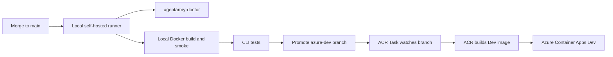

# Azure Container Apps Dev Deploy

This guide defines the AgentArmy pattern for promoting a platform/spoke workload repo from a trusted local PC into an Azure Dev container build lane.

Use this when the local machine is the trusted Docker quality gate, and Azure Container Registry Tasks build the Dev image from a promoted repository branch. The local host proves the workload branch. Azure builds the Dev container from source.

This does not apply to the AgentArmy template repository itself unless a separate platform repo has copied these templates and owns a real workload container.

## Recommended Shape



AgentArmy owns the standard and templates. Each platform/spoke workload repo owns its service names, Dockerfile, layer manifest, Azure resource names, and service-specific smoke checks.

## When To Use This

Use the Azure Dev container lane when a platform/spoke repo:

- has real container runtime behavior to prove
- other developers need a shared Dev endpoint
- the service depends on Azure-only resources such as Container Apps, Key Vault, Azure OpenAI, Azure SQL, or private ACR
- a local Docker pass is useful but not enough confidence

Do not use it when:

- the repo is only template/docs content, such as AgentArmy itself
- untrusted fork code would run on the local Docker host
- the change should deploy directly to production
- the host runner or operator account can read unrelated personal secrets

## Two Supported Modes

| Mode | Best for | Authentication |
|---|---|---|
| Local Docker gate | Normal Dev path after merge. | GitHub token with branch write. |
| ACR branch build | Azure-side Dev image build from promoted branch. | ACR Task Git webhook/token. |
| Direct local push | Break-glass or early spoke shaping. | `az login` user session. |

Use the local Docker gate as the first-class path. Direct local push is only for early experiments or recovery work.

## Host Requirements

The local PC needs:

- Docker Desktop or Docker Engine
- Docker Compose v2 when the spoke has a compose smoke test
- Azure CLI with the `containerapp` extension
- GitHub CLI when triggering workflows or setting repo variables
- a GitHub Actions self-hosted runner with the `docker-local` label when using the workflow mode
- no personal provider keys, Codex local config, Claude local settings, or cloud credentials committed into the repo

Check the host with:

```powershell
scripts/azure/Test-AzureDevContainerPrereqs.ps1 `
  -ResourceGroup "<dev-resource-group>" `
  -AcrName "<acr-name>" `
  -ContainerAppName "<container-app-name>"
```

## Spoke Repository Contract

Each Azure Dev container platform/spoke repo should commit:

```text
.agent/layer.json
agentarmy.services.json
Dockerfile
.dockerignore
.env.example
.github/workflows/local-docker-gate-to-acr-dev.yml
acr-task.yaml
```

The workflow and local script templates live in:

```text
templates/azure-container-apps-dev/
```

The spoke should not commit:

```text
.env
.env.local
.azure/*.local.env
.codex/config.local.toml
.claude/settings.local.json
provider keys
Azure credential JSON
machine-specific paths
```

## Azure Resource Standard

Dev container platform/spoke repos should use these resource boundaries:

| Resource | Standard |
|---|---|
| Resource group | One Dev resource group per system or bounded platform area. |
| Azure Container Registry | Shared Dev ACR is acceptable for related spokes. Use repository names per service. |
| Container App | One Container App per meaningful service boundary. |
| Container App Environment | Shared by related Dev services that need the same network and observability plane. |
| Identity | Prefer managed identity for runtime access from Container Apps to Azure resources. |
| Secrets | Store runtime secrets in Key Vault or Container Apps secrets, not in repo YAML. |

Use image tags that identify the source:

```text
<acr>.azurecr.io/<service>:<git-sha>
<acr>.azurecr.io/<service>:dev-{{.Run.ID}}
```

Avoid deploying `latest` as the only tag. A unique tag makes rollbacks and debugging much less slippery.

## First-Class Flow

The preferred Dev lane is branch promotion:

```text
main -> local Docker gate -> azure-dev -> ACR Task -> Dev image
```

The local self-hosted runner owns these gates:

1. Check out the merged commit.
2. Run `agentarmy-doctor`.
3. Build the image with local Docker.
4. Run CLI and smoke tests.
5. Push or fast-forward only the configured Dev source branch, usually `azure-dev`.

Azure owns these gates:

1. ACR Task detects the `azure-dev` branch update.
2. ACR Task builds from repo source.
3. ACR stores the resulting Dev image tag.
4. A downstream Azure Dev deployment lane updates Container Apps Dev when configured.

This avoids trusting a locally pushed image as the shared Dev artifact. The local machine proves the source. Azure builds the artifact.

## Local Docker Gate Workflow

Copy:

```text
templates/azure-container-apps-dev/github-actions-local-docker-gate-to-acr-dev.yml
```

to:

```text
.github/workflows/local-docker-gate-to-acr-dev.yml
```

Required repository or environment variables:

| Variable | Example |
|---|---|
| `AZURE_DEV_SOURCE_BRANCH` | `azure-dev` |
| `AGENTARMY_SERVICE_NAME` | `career-api` |

The workflow runs on `self-hosted` + `docker-local`, builds locally, runs diagnostics and optional CLI tests, then promotes the Dev source branch only after those checks pass.

## ACR Branch Build Task

Copy:

```text
templates/azure-container-apps-dev/acr-task.yaml
```

to the spoke root. Configure ACR Tasks to watch the promoted branch:

```powershell
templates/azure-container-apps-dev/Configure-AcrBranchBuildTask.ps1 `
  -AcrName "<acr-name>" `
  -TaskName "<service>-dev-build" `
  -RepositoryUrl "https://github.com/<owner>/<repo>.git" `
  -Branch "azure-dev" `
  -ImageRepository "<service>" `
  -GitAccessToken "<github-token>"
```

ACR Tasks can watch a GitHub or Azure DevOps repository branch and build when that branch changes. For private repositories, provide a Git token with the minimum required repository access for ACR to create and use the webhook.

## Direct Local Push Escape Hatch

The direct push script remains available for early experiments:

```text
templates/azure-container-apps-dev/Deploy-AzureContainerAppDev.ps1
```

Use it only when branch-triggered ACR Tasks are not ready yet. It is not the preferred shared Dev path because it makes the local machine the image producer instead of just the source gate.

## Azure Variables For Dev

| Variable | Example |
|---|---|
| `AZURE_SUBSCRIPTION_ID` | `00000000-0000-0000-0000-000000000000` |
| `AZURE_TENANT_ID` | `00000000-0000-0000-0000-000000000000` |
| `AZURE_CLIENT_ID` | `00000000-0000-0000-0000-000000000000` |
| `AZURE_RESOURCE_GROUP_DEV` | `rg-career-dev` |
| `AZURE_ACR_NAME_DEV` | `careerdevelopmentacr` |
| `AZURE_CONTAINER_APP_DEV` | `career-api-dev` |
| `AZURE_DEV_SOURCE_BRANCH` | `azure-dev` |

Use OIDC with `azure/login` for Azure-side workflows when GitHub Actions needs Azure control-plane access. For ACR Tasks watching a private GitHub repository, use the token ACR requires for the source webhook and rotate it regularly.

## Deployment Gates

Before promoting to Azure Dev:

1. Run `node tools/agentarmy-doctor.mjs --write-artifacts`.
2. Build locally with Docker.
3. Run local CLI and smoke tests.
4. Promote only the configured Dev source branch.
5. Let ACR build from the promoted branch.
6. Capture ACR task run, image tag, and Dev endpoint evidence where configured.

Do not promote Dev images to QA/UAT/Prod from this local lane. Promotion should be a separate environment-gated workflow.

## Relationship To Local Docker CI

Local Docker CI proves that the branch can build and run on the trusted local host. The ACR branch build proves Azure can build the same branch from source.

The usual order is:

```text
offline diagnostics -> local Docker smoke -> CLI tests -> promote azure-dev branch -> ACR branch build -> Dev endpoint smoke
```

When a platform/spoke workload is still early, the first two steps are enough. Add Azure Dev once another person or service needs a stable shared endpoint.

## Source Notes

This pattern follows the current Azure guidance that:

- Azure Container Registry supports `az acr login` for CLI-based Docker push and pull flows: [Azure Container Registry authentication](https://learn.microsoft.com/azure/container-registry/container-registry-authentication).
- Azure Container Registry Tasks support Git source contexts, including repository branches such as `https://github.com/user/repo.git#branch`, and can trigger builds when commits land on that branch: [ACR Tasks overview](https://learn.microsoft.com/azure/container-registry/container-registry-tasks-overview).
- GitHub Actions can authenticate to Azure with OIDC instead of storing long-lived Azure credential JSON: [GitHub OIDC for Azure](https://docs.github.com/actions/security-for-github-actions/security-hardening-your-deployments/configuring-openid-connect-in-azure) and [Azure Login](https://github.com/Azure/login).
- Azure Container Apps can use managed identities to access Azure resources and pull from private registries: [Managed identities in Azure Container Apps](https://learn.microsoft.com/azure/container-apps/managed-identity) and [ACR image pull with managed identity](https://learn.microsoft.com/azure/container-apps/managed-identity-image-pull).
