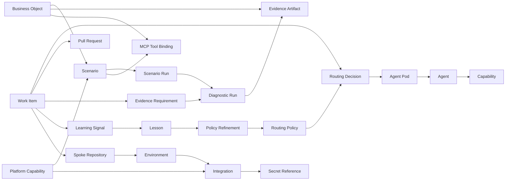
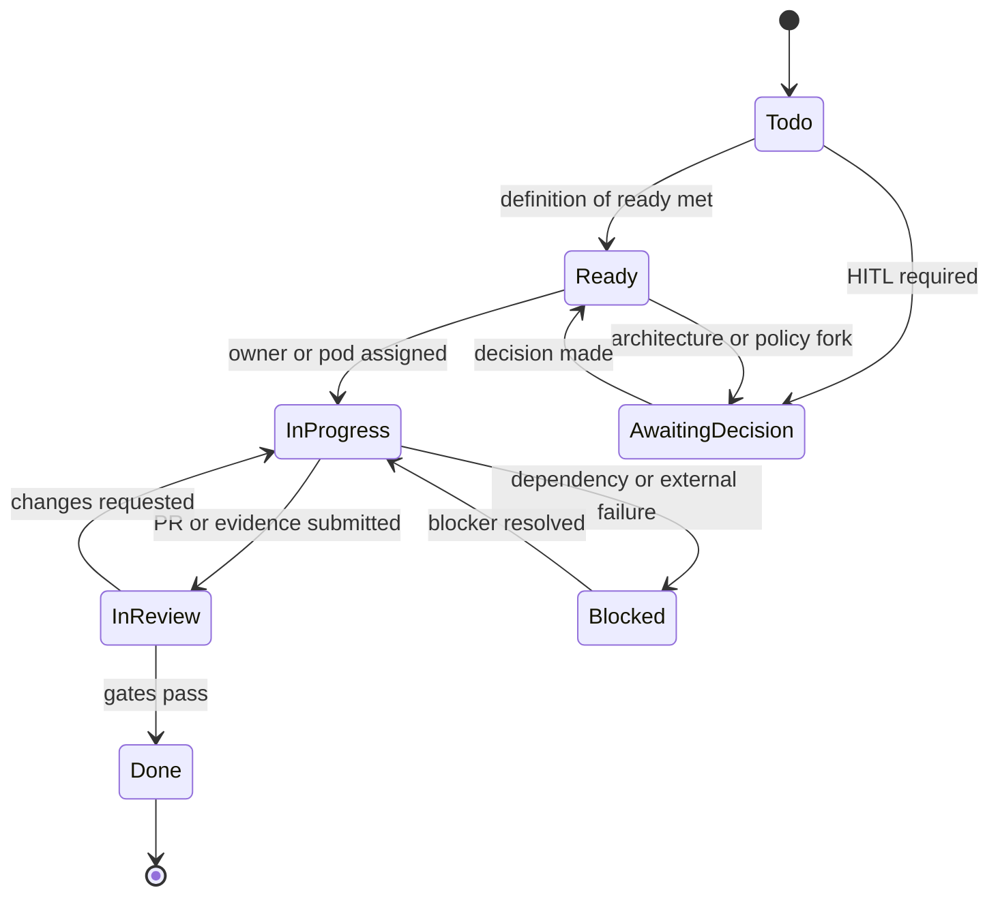

# Backend-Core Object Model

This page defines the intended backend-core model behind the AgentArmy Platform API. It is a contract and design artifact, not an application implementation.

The short version: backend-core should become both a capability provider and a control plane. It should turn AgentArmy from a documented template into an executable, auditable, evidence-driven platform for coordinating specialist agents, exercising new platform capabilities, composing scenarios, and eventually exposing those scenarios as MCP tools.

## Intended Goal

The existing OpenAPI spec describes a platform API for:

- agent roster and capability discovery,
- task routing,
- work-item coordination,
- diagnostics and proof artifacts,
- platform configuration,
- environments and integrations.

The sibling `backend-core` and `frontend-core` repos reveal another important layer:

- `backend-core` already acts as an ArcadeDB provider spoke: land raw files, track ingest jobs, store raw objects, index chunks and images, run cross-modal vector search, expose schema/graph/query cockpit features, and seed a Rust `/api/v2` control-plane API.
- `frontend-core` is a contract consumer and console: it uploads files, searches text and images, explores the ArcadeDB graph cockpit, and smoke-checks the Rust API.

That means the useful backend behind the AgentArmy Platform API should do more than store CRUD records. It should answer operational questions:

- Who or what should handle this work?
- Why was that route chosen?
- What rules made the work ready or not ready?
- Which repo, project, PR, diagnostic run, and evidence artifacts prove the outcome?
- What failed, what was learned, and how should routing or prompts improve next time?
- Which integration, environment, or secret reference is involved, without exposing secrets?
- Which platform capability is this exercising?
- Which reusable scenario is being composed from this capability?
- Which scenario or backend action can safely become an MCP tool?

## Platform Service Layers

Backend-core should be modeled with three complementary service families. The business-object and scenario responsibilities can graduate into a deployable `middle-core` container instead of living inside `backend-core` forever.

| Layer | Purpose | Current evidence |
|---|---|---|
| ArcadeDB capability services | Make concrete ArcadeDB capabilities usable and inspectable. | Ingest, raw object storage, async jobs, semantic/vector search, graph snapshot, schema inventory, read-only query console. |
| Platform operational services | Serve the platform control plane itself. | Agent routing API, work items, diagnostics, platform config, environments, integrations, evidence, and audit. |
| Meta-services | Coordinate how capabilities are composed, governed, validated, routed, learned from, and exposed. | Scenario templates, scenario runs, capability exercises, tool offerings, console views, future MCP bindings. |

This keeps the platform playful and powerful: every new capability should have a useful scenario that exercises its features, a cockpit or console surface that makes it visible, diagnostics that prove it works, and a clean path to expose the safe pieces as tools.

`middle-core` is the deployable home for the business-object catalog and meta-service contracts. It should call `backend-core` for ArcadeDB facts, call platform operational APIs for work/evidence/routing facts, and return stable objects and scenario projections to UIs, agents, and future MCP tools.

The current template includes a C#/.NET `middle-core` container starter under `templates/middle-core/`. It exposes catalog, object, scenario, and health read endpoints over the business-object catalog while keeping the JavaScript catalog CLI as local AgentArmy tooling.

## Domain Map

## Aggregate Model

### Platform Tenant

The current spec does not expose tenant endpoints, but backend-core should still model a tenant boundary internally. For this template, a tenant can be the owner, organization, or platform installation that owns the AgentArmy control plane.

Core fields:

| Field | Purpose |
|---|---|
| `id` | Stable tenant or installation ID. |
| `owner` | GitHub owner or organization. |
| `projectNumber` | GitHub Projects v2 board number. |
| `defaultPolicyVersion` | Routing policy version used when a request does not pin one. |
| `createdAt`, `updatedAt` | Audit timestamps. |

Rules:

- Every mutable object belongs to exactly one tenant.
- Cross-tenant routing is disallowed unless a future federation contract explicitly permits it.
- Tenant config may store references to secrets, never raw secret values.

### Principal

Principals are the actors behind API calls, routing requests, diagnostics, and audit events.

Core fields:

| Field | Purpose |
|---|---|
| `id` | Stable principal ID. |
| `kind` | `human`, `agent`, `service-account`, `ci-runner`, or `integration`. |
| `displayName` | Human-readable actor name. |
| `scopes` | Authorized API scopes. |
| `tenantId` | Tenant boundary. |
| `repoScopes` | Repositories this principal can touch. |
| `environmentScopes` | Environments this principal can affect. |
| `lastAuthenticatedAt` | Latest trusted authentication time. |

Rules:

- `triggeredBy` fields should resolve to a principal or actor reference, not only a free string.
- Agent principals can submit evidence only for delegated or explicitly permitted work.
- CI runner principals can upload diagnostics but cannot modify platform config unless granted admin scope.
- Human, agent, service, runner, and integration actors must be distinguishable in audit logs.

### Spoke

A spoke is a managed repository or service slice. It is the platform's unit of onboarding, diagnostics, and delivery ownership.

Core fields:

| Field | Purpose |
|---|---|
| `id` | Stable spoke ID. |
| `name` | Human-readable spoke name. |
| `repoFullName` | GitHub `owner/repo`. |
| `layer` | `hub`, `frontend`, `backend`, `worker`, `data`, `infra`, `mobile`, `contracts`, or `extension`. |
| `lifecycleStage` | `template`, `local`, `dev`, `staging`, `prod`, `archived`. |
| `serviceManifestPath` | Optional path to `agentarmy.services.json` or `.agent/services.json`. |
| `defaultEnvironmentId` | Default environment for smoke checks. |
| `owners` | Humans, teams, or agent roles with ownership. |

Rules:

- Backend-core should not infer service behavior from framework guessing when a manifest declares it.
- A work item that touches more than one spoke needs an integration owner.
- Spokes can inherit platform policies but may add stricter rules for language, compliance, or deployment.

### Agent

Agents are specialists with capabilities, boundaries, and operational posture. The current OpenAPI `Agent.type` is useful but too coarse for actual routing.

Core fields:

| Field | Purpose |
|---|---|
| `id` | Stable agent ID. |
| `name` | Agent name such as `api-designer`. |
| `category` | Roster category, such as `core-development` or `enterprise-architecture`. |
| `podRoles` | Roles the agent can play: `owner`, `reviewer`, `qa`, `security`, `docs`, `orchestrator`. |
| `capabilities` | Stable capability IDs. |
| `boundaryRules` | When to use this agent and when to use a neighbor. |
| `trustLevel` | Eligibility tier for normal, privileged, security, or production-affecting work. |
| `allowedRepos` | Repositories the agent may operate on. |
| `allowedEnvironments` | Environments the agent may affect. |
| `tools` | Allowed tool families or external systems. |
| `status` | `active`, `idle`, `offline`, `error`, or `deprecated`. |
| `availability` | Current capacity, concurrency, cooldown, and health posture. |
| `version` | Source definition version or hash. |
| `lastSeenAt` | Latest sync or heartbeat time. |

Rules:

- Capabilities must have stable IDs. Display names can change; IDs should not.
- A routing decision must record the agent version used at decision time.
- `Agent.type` should not be used as a substitute for category, capability, or pod role.
- Deprecated agents can remain visible for audit history but must not receive new assignments.
- Routing must reject stale, offline, unauthenticated, over-scoped, or unapproved agents.

### Capability

Capabilities are routeable units of skill.

Core fields:

| Field | Purpose |
|---|---|
| `id` | Stable kebab-case ID. |
| `name` | Human-readable capability. |
| `domain` | Product, backend, security, docs, infra, data, AI, etc. |
| `maturity` | `experimental`, `supported`, `preferred`, `deprecated`. |
| `requiresTools` | Tool or integration requirements. |
| `evidenceSignals` | Signals that prove the capability performed well. |

Rules:

- Routing can require multiple capabilities.
- Capability conflicts require a boundary rule or a human decision artifact.
- Capability maturity should influence routing score.
- Privileged capabilities require a capability grant that ties the agent, scope, task class, and allowed environment together.

### Platform Capability

A platform capability is something backend-core can exercise directly, such as ArcadeDB graph traversal, vector search, raw object landing, schema inspection, query policy, or future provider features.

Core fields:

| Field | Purpose |
|---|---|
| `id` | Stable capability ID such as `arcadedb.vector-search`. |
| `provider` | `arcadedb`, `github`, `postman`, `doctor`, `mcp`, or future provider. |
| `category` | `graph`, `vector`, `document`, `object-store`, `diagnostic`, `routing`, `workflow`, `integration`, `tool`. |
| `operations` | Supported backend operations. |
| `readModel` | What the console/cockpit can safely display. |
| `mutationPolicy` | Whether mutations are disabled, guarded, admin-only, or scenario-owned. |
| `evidenceChecks` | Diagnostics that prove the capability is healthy. |
| `mcpEligible` | Whether the capability can be exposed as an MCP tool. |

Rules:

- Every new provider feature should map to a platform capability before becoming a public endpoint.
- A capability should have at least one scenario that demonstrates why it matters.
- Capabilities should hide provider-specific query languages behind backend policy when possible.
- Browser clients should see product concepts, not raw provider credentials or unrestricted database plumbing.

Current ArcadeDB capability candidates:

| Capability | Useful operations |
|---|---|
| `arcadedb.raw-object-landing` | Store, retrieve, and reprocess original files and images. |
| `arcadedb.async-ingest-jobs` | Queue, poll, retry, and inspect ingestion/indexing work. |
| `arcadedb.cross-modal-vector-search` | Search text and images through one embedding space. |
| `arcadedb.schema-inventory` | Inspect types, fields, indexes, counts, and samples. |
| `arcadedb.graph-snapshot` | Render database/type/source/chunk/job relationships. |
| `arcadedb.read-only-query` | Run policy-checked read-only SQL or graph queries. |
| `arcadedb.vector-neighbors` | Explore similar chunks, images, or records. |

### Business Object

Business objects are the middle layer between provider mechanics and platform orchestration. They are the nouns a user, console, scenario, or MCP tool can understand without knowing whether the underlying implementation is ArcadeDB, GitHub Projects, Postman, a doctor artifact, or a future provider.

Core fields:

| Field | Purpose |
|---|---|
| `id` | Stable business object ID. |
| `type` | Business object type, such as `knowledge-source`, `evidence-pack`, or `decision-record`. |
| `displayName` | Human-readable name. |
| `providerRefs` | Backing provider records, such as ArcadeDB RIDs, GitHub issue URLs, artifact paths, or diagnostic run IDs. |
| `state` | Business lifecycle state. |
| `ownership` | Owning spoke, principal, work item, or scenario. |
| `policyTags` | Security, retention, environment, and MCP exposure tags. |
| `summary` | Small, safe read model for cards, search results, and tool responses. |
| `relationships` | Links to other business objects. |
| `evidenceRefs` | Diagnostics, artifacts, or scenario runs that prove this object is current. |

Rules:

- Business objects should not leak raw provider credentials, opaque payloads, or unrestricted query surfaces.
- Business objects can be backed by provider records, but provider records are not the public product model.
- Scenarios should consume and emit business objects where possible.
- MCP tools should prefer business-object inputs and outputs over provider-specific inputs.
- A business object can have multiple projections: API response, graph node, UI card, diagnostic evidence, and MCP tool output.

Initial business object candidates:

| Business object | Meaning | Backing capabilities |
|---|---|---|
| `KnowledgeSource` | A user- or agent-provided file, image, document, mailbox export, report, or dataset that can be searched, reprocessed, and cited. | Raw object landing, ingest jobs, chunking, vector search. |
| `KnowledgeChunk` | A searchable semantic fragment from a source, including text or image-derived embeddings. | Cross-modal vector search, vector neighbors. |
| `KnowledgeGraphSnapshot` | A safe graph view of sources, chunks, jobs, objects, types, and derived relationships. | Schema inventory, graph snapshot, read-only query. |
| `CapabilityExercise` | A reusable proof that a capability works for a concrete scenario. | Scenario runs, diagnostics, artifacts. |
| `EvidencePack` | A bundle of diagnostic runs, artifacts, screenshots, contract checks, and notes proving work or a scenario outcome. | Doctor artifacts, diagnostics, work items. |
| `WorkPacket` | A work item plus routing decision, pod assignment, linked PRs, evidence requirements, and current blockers. | Work items, routing, evidence gates. |
| `DecisionRecord` | A HITL or policy decision with context, options, outcome, owner, and downstream effects. | Work items, audit events, learning signals. |
| `ToolOffering` | A safe, documented backend action or scenario that can be exposed to agents through MCP. | Scenario, MCP tool binding, auth policy. |
| `ScenarioTemplate` | A reusable recipe for exercising one or more capabilities. | Platform capabilities, business object schemas. |

### Business Object Catalog

The business object catalog is the registry for these nouns.

Core fields:

| Field | Purpose |
|---|---|
| `objectType` | Stable type ID. |
| `schemaVersion` | Version of the object contract. |
| `description` | Business meaning. |
| `allowedStates` | Lifecycle states. |
| `providerMappings` | How to materialize the object from provider data. |
| `scenarioMappings` | Scenarios that consume or emit this object. |
| `mcpEligibility` | Whether the object can appear in MCP inputs or outputs. |
| `redactionPolicy` | What must be hidden or summarized. |

Rules:

- Each object type should have a short contract before it is used by multiple scenarios.
- Object contracts should be additive and versioned.
- Provider mappings can change without forcing UI or MCP clients to learn new provider details.
- The catalog becomes the stable middle layer that keeps the platform from feeling like a bag of endpoints.

### Scenario

A scenario is a modular, repeatable composition that makes a platform capability useful. Scenarios are where the platform can feel fun without becoming toy-like: each scenario should teach, validate, and produce reusable evidence.

Core fields:

| Field | Purpose |
|---|---|
| `id` | Stable scenario ID. |
| `name` | Human-readable name. |
| `description` | What the scenario proves or enables. |
| `capabilityIds` | Platform capabilities exercised. |
| `inputs` | Typed inputs, files, prompts, query parameters, or environment refs. |
| `steps` | Ordered backend actions. |
| `outputs` | Results, artifacts, visualizations, tool responses, or links. |
| `safetyPolicy` | Auth, size, mutation, redaction, and environment limits. |
| `diagnosticProfile` | Checks to run before or after the scenario. |
| `mcpToolBindingId` | Optional MCP exposure. |

Rules:

- Scenarios should be small enough to compose.
- Scenarios own the user-facing story; capabilities own the provider-specific mechanics.
- Scenario runs should produce evidence artifacts when they validate a capability.
- Scenario inputs and outputs must be schema-constrained before MCP exposure.

Example scenario families:

| Scenario | Exercises |
|---|---|
| `knowledge-drop` | Upload mixed files, create ingest jobs, land raw objects, index text/images. |
| `semantic-constellation` | Search a query, then show related text/image/object nodes in the graph cockpit. |
| `schema-scout` | Snapshot ArcadeDB types, indexes, fields, counts, and samples for operator review. |
| `read-only-query-lab` | Run a safe SQL or graph query and record metrics without exposing credentials. |
| `evidence-pack` | Attach diagnostics, search results, screenshots, and contract checks to a work item. |
| `agent-route-and-prove` | Route a task, assign a pod, run required diagnostics, and capture learning signals. |

### Scenario Run

A scenario run is one execution of a scenario.

Core fields:

| Field | Purpose |
|---|---|
| `id` | Stable run ID. |
| `scenarioId` | Scenario definition executed. |
| `principalId` | Actor that triggered the run. |
| `environmentId` | Environment used. |
| `status` | `pending`, `running`, `passed`, `failed`, `blocked`, `cancelled`. |
| `inputsHash` | Hash of normalized inputs. |
| `outputs` | Typed outputs and links. |
| `diagnosticRunIds` | Diagnostics associated with the run. |
| `artifactIds` | Evidence produced. |
| `startedAt`, `completedAt` | Timing. |

Rules:

- Scenario runs are the bridge between playful exploration and serious evidence.
- Failed scenario runs should create learning signals when the failure is reusable.
- Scenario runs that touch mutable provider state need idempotency keys and compensation notes.

### MCP Tool Binding

An MCP tool binding exposes a safe backend action or scenario as a tool.

Core fields:

| Field | Purpose |
|---|---|
| `id` | Stable tool binding ID. |
| `name` | MCP tool name. |
| `description` | Tool description for agents. |
| `scenarioId` | Scenario or backend action behind the tool. |
| `inputSchema` | JSON Schema for tool input. |
| `outputSchema` | JSON Schema for tool output. |
| `authPolicy` | Required scopes and allowed principals. |
| `rateLimitPolicy` | Tool-specific rate and size limits. |
| `redactionPolicy` | Output redaction rules. |
| `enabled` | Whether the tool is available. |

Rules:

- MCP tools should expose scenario-level intent, not raw database commands by default.
- Read-only tools can graduate before mutation tools.
- Tool output should link to scenario runs and evidence artifacts where useful.
- Unsafe provider capabilities need an explicit scenario safety policy before tool exposure.

### Routing Policy

Routing policy is the keystone backend-core object. It is the executable projection of the routing matrix and specialist taxonomy.

Core fields:

| Field | Purpose |
|---|---|
| `id` | Stable policy ID. |
| `version` | Semantic version or content hash. |
| `sourcePath` | Example: `.github/routing-policy.yaml`. |
| `status` | `draft`, `active`, `superseded`, `retired`. |
| `rules` | Ordered route rules with conditions, priorities, and rationale. |
| `testSuiteRef` | Validator or test-case reference. |
| `activatedAt` | Time this version became active. |

Rules:

- Every routing decision records the policy version used.
- Lower numeric priority wins when rules conflict, matching the existing routing decision tree.
- Policy changes must run route validation before activation.
- A policy can recommend a single owner or a pod.

### Routing Decision

A routing decision is an auditable answer to "who should do this work, and why?"

Core fields:

| Field | Purpose |
|---|---|
| `id` | Stable decision ID. |
| `workItemId` | Work item being routed. |
| `request` | Normalized task descriptor, labels, issue type, size, risk, repo, and capabilities. |
| `policyVersion` | Routing policy version used. |
| `candidates` | Ranked candidates with scores and disqualifiers. |
| `selectedAgentId` | Single selected owner when applicable. |
| `selectedPodId` | Selected pod for complex work. |
| `score` | Final route confidence. |
| `reason` | Human-readable rationale. |
| `requiredGates` | Gates that must pass before work is done. |
| `denials` | Candidates rejected by scope, status, trust, or capability policy. |
| `traceId` | Correlation trace for observability. |

Rules:

- Decisions must be reproducible from saved inputs and policy version.
- Score alone is not enough; a reason and rule references are required.
- Critical, security-sensitive, or architecture-affecting work must add reviewer gates.
- If no candidate meets threshold, create or reference a HITL decision rather than silently assigning.
- Security-sensitive work can route only to agents with approved security or reviewer grants.

### Agent Pod

A pod is a structured multi-agent assignment for work that needs more than one lens.

Core fields:

| Field | Purpose |
|---|---|
| `id` | Stable pod ID. |
| `workItemId` | Work item being handled. |
| `ownerAgentId` | Accountable owner. |
| `reviewerAgentIds` | Advisory or required reviewers. |
| `qaAgentIds` | Test or validation owners. |
| `securityAgentIds` | Security or compliance reviewers. |
| `docsAgentIds` | Documentation owners. |
| `handoffPlan` | Explicit handoff and file ownership. |

Rules:

- Exactly one owner is accountable per file or artifact.
- Reviewers are advisory unless assigned an explicit gate.
- Pods should be small by default: owner plus the sidecars justified by risk.
- A pod must not assign two editors to the same shared file at the same time.

### Work Item

Work items mirror GitHub Projects v2 and add platform-specific execution state. The API should not invent a conflicting board model.

Core fields:

| Field | Purpose |
|---|---|
| `id` | Backend-core work item ID. |
| `externalRef` | GitHub issue or project item reference. |
| `title`, `description` | Work summary. |
| `type` | `epic`, `feature`, `story`, `enabler`, `bug`, `spike`, `chore`, `decision`. |
| `status` | Board-aligned: `todo`, `ready`, `in-progress`, `in-review`, `done`, `awaiting-decision`, `blocked`. |
| `priority` | `p0`, `p1`, `p2` plus optional API priority mapping. |
| `size` | `xs`, `s`, `m`, `l`, `xl`. |
| `estimate` | Story points or explicit effort. |
| `pi` | Program increment. |
| `iteration` | Sprint or iteration. |
| `parentId` | Parent feature or epic. |
| `dependencies` | Blocking or related work items. |
| `assignedAgentId` | Backward-compatible single assigned agent. |
| `podId` | Preferred model for complex work. |
| `linkedPRs` | Pull requests associated with the work. |
| `evidenceRequirements` | Required validation proof. |

Rules:

- `decision` and `enabler` are first-class types because the board and roadmap use them.
- A work item cannot move to `ready` until Definition of Ready fields are present.
- A work item cannot move to `done` until required evidence is satisfied or explicitly waived.
- A work item with unresolved blockers cannot move to `in-progress` unless the transition reason explains the exception.
- Linked PRs must reference the issue with `Closes #N`, `Fixes #N`, or `Resolves #N` when the work is intended to close it.

### Pull Request

Pull requests are delivery evidence and automation triggers.

Core fields:

| Field | Purpose |
|---|---|
| `repo` | GitHub repo full name. |
| `number` | PR number. |
| `url` | Browser URL. |
| `state` | `draft`, `open`, `merged`, `closed`. |
| `changedFiles` | Count and optional file summary. |
| `checks` | CI check summary. |
| `reviewState` | Review status and unresolved comment count. |
| `closesIssue` | Whether PR body contains a closing reference. |

Rules:

- PRs over the size threshold should require deep review.
- Security-sensitive PRs require security review even if small.
- A merged PR can satisfy a work item only when required checks and review gates pass.

### Diagnostic Run

Diagnostic runs normalize proof across local CLI, CI, dashboards, and future backend services.

Core fields:

| Field | Purpose |
|---|---|
| `id` | Stable run ID. |
| `scope` | `local`, `smoke`, `contract`, `regression`, `full`, or future scope. |
| `status` | `pending`, `running`, `passed`, `failed`, `skipped`, `error`. |
| `triggeredBy` | Human, agent, workflow, or integration. |
| `workItemId` | Optional related work item. |
| `prRef` | Optional related PR. |
| `spokeId` | Optional spoke. |
| `environmentId` | Optional environment. |
| `summary` | Counts by status. |
| `checks` | Normalized check results. |
| `artifacts` | Evidence artifacts. |
| `redactionReport` | What sensitive fields were removed. |

Rules:

- Backend-core should accept the `doctor.v1` envelope as a canonical input.
- Diagnostics are evidence, not merely logs.
- Claimed validation and executed validation must be distinguishable.
- Generated artifacts stay out of Git unless they are curated examples.
- Evidence must be redacted before browser or docs consumption.

### Evidence Artifact

Artifacts are proof units: test reports, coverage, screenshots, logs, contract results, and generated summaries.

Core fields:

| Field | Purpose |
|---|---|
| `id` | Stable artifact ID. |
| `runId` | Diagnostic run that produced it. |
| `workItemId` | Optional work item linkage. |
| `name` | Human-readable file name. |
| `type` | `test-report`, `coverage`, `screenshot`, `log`, `contract`, `trace`, `summary`, `sbom`. |
| `mimeType` | Content type. |
| `storageRef` | Internal storage pointer or URL. |
| `hash` | Integrity hash. |
| `redactionStatus` | `not-required`, `redacted`, `blocked`, `unknown`. |

Rules:

- Raw logs with secrets cannot be exposed through public artifact URLs.
- Artifacts that satisfy a done gate need immutable hash or storage reference.
- Evidence should attach to both the run and the relevant work item when possible.

### Evidence Requirement

Evidence requirements define what "done" means for different work types.

Core fields:

| Field | Purpose |
|---|---|
| `id` | Stable requirement ID. |
| `workItemType` | Type this applies to. |
| `riskClass` | `standard`, `architecture`, `security`, `data`, `infra`, `compliance`. |
| `requiredArtifacts` | Artifact types or check IDs. |
| `waiverPolicy` | Who can waive and why. |

Rules:

- Backend/API contract work requires OpenAPI validation and contract examples.
- Docs-only work requires docs build or markdown validation when available.
- Security-sensitive work requires security review evidence.
- Infrastructure work requires dry-run, plan, or diagnostics evidence appropriate to the tool.

### Learning Signal

Learning signals capture opportunities to improve the platform from failures, review comments, or repeated friction.

Core fields:

| Field | Purpose |
|---|---|
| `id` | Stable signal ID. |
| `source` | PR review, diagnostic failure, route miss, HITL decision, user correction. |
| `workItemId` | Optional related work item. |
| `agentId` | Optional related agent. |
| `summary` | What happened. |
| `severity` | `low`, `medium`, `high`, `critical`. |
| `candidateAction` | Policy, prompt, docs, test, agent definition, or template change. |
| `status` | `candidate`, `accepted`, `rejected`, `implemented`. |

Rules:

- A failed delegation should produce a learning signal.
- A repeated review comment should produce a policy or prompt refinement candidate.
- Accepted lessons must link to the artifact that implements the change.

### Lesson

Lessons are curated learning signals that future routing and prompts can consume.

Core fields:

| Field | Purpose |
|---|---|
| `id` | Stable lesson ID. |
| `pattern` | Failure or success pattern. |
| `rootCause` | Why it happened. |
| `recommendation` | What to do next time. |
| `appliesTo` | Agent, capability, spoke, task type, or policy area. |
| `evidenceRefs` | Work items, PRs, diagnostics, comments. |
| `supersedes` | Prior lesson IDs if replaced. |

Rules:

- Lessons should be few, useful, and evidence-backed.
- Lessons can influence routing score only after acceptance.

### Platform Config

Platform config governs runtime behavior.

Core fields:

| Field | Purpose |
|---|---|
| `agentTimeoutSeconds` | Default delegation timeout. |
| `maxConcurrentRuns` | Tenant-level concurrency cap. |
| `defaultPageSize` | API default pagination. |
| `routingThresholds` | Minimum route confidence and HITL threshold. |
| `evidencePolicies` | Default done-gate requirements. |
| `featureFlags` | Backend-owned flags with owner and expiry. |
| `version` | Optimistic concurrency token or revision. |

Rules:

- Config changes require admin authorization and audit logging.
- Feature flags must include owner, reason, expiry, and kill condition.
- Config patches should be partial but validated as a complete effective config before save.
- Config updates should require `If-Match` or an equivalent version check to prevent stale writes.

### Environment

Environments represent lifecycle targets.

Core fields:

| Field | Purpose |
|---|---|
| `id` | Stable environment ID. |
| `slug` | `local`, `mock`, `dev`, `staging`, `prod`. |
| `baseUrl` | API base URL for this environment. |
| `isActive` | Whether the environment is available. |
| `readiness` | Latest readiness posture. |
| `promotionPolicy` | Gates for moving work into the environment. |
| `dataClass` | Expected sensitivity class for evidence and diagnostics. |

Rules:

- Production config changes require stricter authorization than local or mock changes.
- `mock` is a contract-development target, not a deployment promotion stage.
- Environment health should be derived from diagnostics and integration status, not manual flags alone.
- Local or mock evidence cannot satisfy production gates unless an explicit policy says it can.
- Environment, PR, callback, and integration URLs require allowlists to reduce SSRF and malicious-target risks.

### Integration

Integrations connect backend-core to GitHub, Slack, Jira, PagerDuty, Datadog, Postman, provider telemetry, or future systems.

Core fields:

| Field | Purpose |
|---|---|
| `id` | Stable integration ID. |
| `type` | Integration family. |
| `status` | `active`, `inactive`, `error`, `degraded`. |
| `capabilities` | What this integration can do. |
| `config` | Sanitized non-secret config. |
| `secretRefs` | References to secret storage. |
| `oauthScopes` | External scopes granted to the integration. |
| `allowedOperations` | Operations backend-core may perform through this integration. |
| `lastHealthCheck` | Latest health status. |

Rules:

- Integration config can include secret references, never raw secrets.
- Disabling an integration must identify affected capabilities and routes.
- Webhook or token failures should degrade dependent features explicitly.
- Integration config must reject raw token, key, password, and connection-string fields.

### Audit Event

Audit events are append-only records of important decisions and mutations.

Core fields:

| Field | Purpose |
|---|---|
| `id` | Stable audit event ID. |
| `actor` | Principal or integration that caused the action. |
| `action` | Route, transition, config change, integration change, diagnostic trigger, artifact upload, etc. |
| `targetRef` | Object affected. |
| `previousStateHash` | Optional hash or summary of prior state. |
| `nextStateHash` | Optional hash or summary of next state. |
| `policyResult` | Authorization and business-rule decision. |
| `correlationId` | Request correlation ID. |
| `createdAt` | Event time. |

Rules:

- Audit events are append-only.
- Mutations create audit events even when the business operation fails after authorization.
- Audit events must not include raw secrets, raw artifact content, or unredacted credentials.

## Workflow Policies

### Work Item Status Transitions

Transition rules:

| Transition | Required checks |
|---|---|
| `todo -> ready` | Type, priority, size, PI or backlog reason, acceptance criteria, and source repo known. |
| `ready -> in-progress` | Owner or pod assigned; routing decision recorded. |
| `in-progress -> in-review` | Evidence submitted or PR linked. |
| `in-review -> done` | Required gates pass; unresolved review threads are closed or waived. |
| any -> `awaiting-decision` | Decision artifact records the question, owner, and unblock criteria. |
| any -> `blocked` | Blocker has owner, reason, and next check date. |

### Routing Scoring

Backend-core can score candidates with a transparent weighted model:

| Signal | Example weight |
|---|---:|
| Required capability match | 35 |
| Boundary-rule match | 20 |
| Task type and issue label match | 15 |
| Spoke or language familiarity | 10 |
| Current availability | 10 |
| Historical success on similar work | 5 |
| Required tool availability | 5 |

Disqualifiers:

- agent is offline or deprecated,
- required tool is unavailable,
- task violates agent boundary rules,
- security or compliance gate requires an unavailable reviewer,
- conflict of ownership for the same file or artifact.

### Pod Composition

Use one owner plus sidecars:

| Work shape | Suggested pod |
|---|---|
| Small docs/config change | Owner only, optional docs reviewer. |
| API contract change | `api-designer` owner, `contract-test-engineer` or `security-auditor` reviewer. |
| Backend service implementation | Backend owner, API reviewer, QA sidecar, security sidecar if auth/secrets/user data are involved. |
| Platform diagnostics | CLI/tooling owner, platform reviewer, QA reviewer, docs owner. |
| Enterprise architecture | Enterprise architect owner, business/information/security/platform sidecars as needed. |

### Evidence Gates

Default gate matrix:

| Work type | Required evidence |
|---|---|
| `documentation` | Docs build or markdown-safe validation where available. |
| `api-contract` | OpenAPI parse, examples, error envelope, and contract collection update. |
| `routing-policy` | Routing validator and ambiguity check. |
| `diagnostics` | Doctor run, artifact schema validation, redaction check. |
| `security-sensitive` | Security review, audit log, secret-reference check. |
| `infra` | Plan/dry-run or environment-specific diagnostic proof. |

## OpenAPI Mapping

The current API can support the model with additive extensions.

| Current API area | Domain objects already implied | Additive gaps |
|---|---|---|
| `GET /agents` | `Agent`, `Capability` | `category`, `podRoles`, `boundaryRules`, `version`, `availability`, `competencyScore`. |
| `POST /agents/route` | `RoutingDecision` | Return `decisionId`, `policyVersion`, `candidates`, `requiredGates`, `selectedPod`, `disqualifiers`. |
| `GET /agents/sync/status` | `AgentRegistrySync` | Include source hashes, stale agents, deprecated agents, and validation errors. |
| `/work-items` | `WorkItem` | Add board-aligned status, `enabler`, `decision`, PI, iteration, size, estimate, parent, dependencies, blockers, pod ID, evidence requirements. |
| `/work-items/{id}/transition` | `WorkItemTransition` | Add transition policy result, failed preconditions, waived gates, and actor. |
| `/work-items/{id}/link-pr` | `PullRequest` | Add close-reference validation, check status, review state, changed file counts. |
| `/diagnostics/runs` | `DiagnosticRun` | Link to work item, PR, spoke, environment; accept `doctor.v1` check details. |
| `/diagnostics/runs/{id}/artifacts` | `EvidenceArtifact` | Add hash, storage reference, redaction status, retention policy. |
| `/config` | `PlatformConfig` | Add routing thresholds, evidence policies, feature flag metadata, audit requirements. |
| `/environments` | `Environment` | Add readiness, promotion policy, lifecycle status, latest diagnostic run. |
| `/integrations` | `Integration` | Add capabilities, secret refs, health, degraded status, affected features. |
| ArcadeDB provider routes | `PlatformCapability`, `Scenario`, `ScenarioRun` | Model ingest, jobs, raw objects, search, schema, graph, query, and metrics as capability operations and scenario building blocks. |

Potential new endpoints:

| Endpoint | Purpose |
|---|---|
| `GET /routing/policies` | List routing policy versions. |
| `GET /routing/decisions/{decision_id}` | Retrieve auditable routing decision details. |
| `POST /work-items/{id}/assign-pod` | Assign a structured owner/reviewer/QA/security/docs pod. |
| `GET /work-items/{id}/evidence` | Show done-gate evidence posture. |
| `POST /diagnostics/runs/import` | Import a `doctor.v1` artifact envelope. |
| `POST /learning/signals` | Capture a learning candidate from failure, review, or HITL. |
| `GET /spokes` | List managed repositories or service slices. |
| `GET /capabilities/platform` | List provider-backed platform capabilities such as ArcadeDB graph and vector operations. |
| `GET /scenarios` | List reusable scenario definitions. |
| `POST /scenarios/{scenario_id}/runs` | Execute a scenario with typed inputs and evidence capture. |
| `GET /scenarios/runs/{run_id}` | Inspect a scenario run, outputs, diagnostics, and artifacts. |
| `GET /mcp/tools` | List enabled MCP tool bindings and schemas. |

## Security And Governance Rules

Authorization scopes:

| Scope | Allows |
|---|---|
| `agents:read` | View roster, capabilities, sync status. |
| `routing:evaluate` | Request routing recommendations. |
| `work:read` | View work items. |
| `work:write` | Create/update work items and link PRs. |
| `work:transition` | Move work across workflow states. |
| `diagnostics:read` | View run summaries and redacted artifacts. |
| `diagnostics:write` | Create runs and upload artifacts. |
| `config:read` | View sanitized platform config. |
| `config:write` | Update platform config. |
| `integrations:admin` | Change integration status or config. |
| `audit:read` | View audit records. |

Security rules:

- All non-health endpoints require auth.
- Admin endpoints require explicit admin scope.
- Integration config stores `secretRef` values, not secrets.
- Artifacts must be redacted before public URL exposure.
- Correlation IDs must appear in error envelopes and audit events.
- Mutations create audit records with actor, request ID, previous state, next state, and policy result.
- Production environment changes require stricter policy than local or mock changes.
- `metadata`, `context`, `config`, and artifact `content` are untrusted input and need schema constraints, size limits, and redaction.
- Artifact uploads need MIME validation, size limits, content hashing, retention class, and optional malware scanning before broad sharing.
- Hooks are governance hints, not hard security controls; backend-core policy and audit must enforce critical rules.

## Contract Mechanics

The current API can remain simple for mocks, but production-oriented backend-core should add standard mutation mechanics.

Headers:

| Header | Use |
|---|---|
| `X-Correlation-ID` | Trace request, errors, audit events, diagnostics, and routing decisions. |
| `Idempotency-Key` | Safe retries for create, route, transition, PR link, diagnostic run, and artifact upload. |
| `ETag` | Current mutable resource version. |
| `If-Match` | Prevent stale `PATCH` and state-transition writes. |

Business error codes:

| Code | Meaning |
|---|---|
| `INVALID_TRANSITION` | Requested work-item or diagnostic transition is not allowed. |
| `AGENT_UNAVAILABLE` | Candidate agent is offline, stale, over capacity, or deprecated. |
| `AGENT_SCOPE_DENIED` | Candidate agent lacks repo, environment, or capability grant. |
| `DUPLICATE_PR_LINK` | PR is already linked to the work item. |
| `CONFIG_VERSION_CONFLICT` | Patch used a stale version. |
| `SECRET_FIELD_REJECTED` | Request attempted to store raw secret material. |
| `EVIDENCE_GATE_UNSATISFIED` | Work cannot move to done because proof is missing. |
| `URL_NOT_ALLOWED` | URL failed environment, PR, callback, or integration allowlist checks. |

## Event Model

Backend-core does not need an event broker on day one, but the object model should be event-ready.

Candidate domain events:

| Event | Emitted when |
|---|---|
| `agent.synced` | Agent registry sync completes. |
| `routing.decision.created` | A route request is evaluated. |
| `work_item.created` | Work is created or mirrored from GitHub. |
| `work_item.transitioned` | Status changes. |
| `pod.assigned` | A multi-agent pod is assigned. |
| `pull_request.linked` | A PR is associated with work. |
| `diagnostic_run.completed` | A run reaches terminal status. |
| `evidence.requirement.satisfied` | A done gate receives valid proof. |
| `learning.signal.created` | A failure or improvement candidate is captured. |
| `integration.degraded` | An integration loses a capability. |
| `platform_capability.changed` | A provider-backed capability is added, removed, or degraded. |
| `scenario.run.completed` | A scenario run reaches terminal status. |
| `mcp.tool_binding.changed` | A backend scenario is exposed, disabled, or changed as an MCP tool. |

## Useful Implementation Slices

Build this incrementally:

1. **Read model**: expose enriched agents, capabilities, work items, environments, and integrations from static or GitHub-backed sources.
2. **Routing decision ledger**: persist route requests, policy version, selected agent/pod, score, and reason.
3. **Work transition policy**: enforce ready/in-progress/review/done rules and surface failed preconditions.
4. **Diagnostics import**: accept `doctor.v1`, link runs to work items/PRs, and compute evidence posture.
5. **Pod assignment**: model owner/reviewer/QA/security/docs roles and file-ownership boundaries.
6. **Learning loop**: capture route misses, failed diagnostics, and review findings as learning signals.
7. **Cost and capacity**: add estimate/actual metrics once observability and provider abstraction are available.
8. **Capability catalog**: register ArcadeDB-backed capabilities and their diagnostic checks.
9. **Scenario runner**: compose capability operations into reusable scenario runs with typed inputs and evidence.
10. **MCP binding layer**: expose safe read-only scenarios as tools before graduating guarded mutations.

## Definition Of Useful

Backend-core is useful when it can answer these with evidence:

- What work is ready, blocked, in review, or done?
- Which agent or pod should own this work, and why?
- What rules and policy version made that decision?
- What proof exists that the work is complete?
- Which diagnostics failed, and what should change next time?
- Which integrations or environments are degraded?
- What learning has been accepted into the platform from recent failures?
- Which capability does this scenario exercise?
- Which scenario runs prove the capability is healthy and useful?
- Which scenarios are safe to expose as MCP tools?

## Immediate Contract Recommendations

For the next OpenAPI revision, prefer additive changes:

1. Add `RoutingDecision`, `RoutingCandidate`, `AgentPod`, and `RequiredGate` schemas.
2. Extend `RouteTaskRequest.context` into a typed object with work item, repo, labels, size, risk, files, and environment.
3. Add board-aligned work-item fields: `size`, `estimate`, `pi`, `iteration`, `parentId`, `dependencies`, `blockedBy`, `externalRef`.
4. Add `decision` and `enabler` to `WorkItem.type`.
5. Add `awaiting-decision`, `todo`, and `ready` status values while preserving compatibility with existing values.
6. Link diagnostic runs and artifacts to work items, PRs, spokes, and environments.
7. Add secret-reference and health metadata to integrations.
8. Add audit metadata to all mutation responses or expose an audit endpoint.
9. Add `Principal`, `AuditEvent`, `CapabilityGrant`, and `SecretReference` schemas.
10. Add `Idempotency-Key`, `ETag`, and `If-Match` mechanics for retry-safe writes and stale-write protection.
11. Add `PlatformCapability`, `Scenario`, `ScenarioRun`, and `McpToolBinding` schemas.
12. Add scenario-run endpoints that can wrap ArcadeDB ingest, search, schema, graph, vector, and query capabilities without exposing raw provider credentials.

## Contract Test Recommendations

Add tests and examples for:

- role-based `401` and `403` outcomes per API area,
- stale or offline agents rejected by routing,
- security-sensitive work requiring approved security reviewers,
- invalid work-item transitions and missing evidence gates,
- duplicate PR link idempotency,
- stale config patch conflicts,
- redacted integration config responses,
- rejected raw secret fields,
- URL allowlist failures for environment, PR, and callback URLs,
- `doctor.v1` import with redacted artifacts and correlation IDs,
- scenario runs that exercise ArcadeDB ingest, graph, vector search, and read-only query policy,
- MCP tool binding schemas that reject unsafe raw SQL or unrestricted provider operations.
