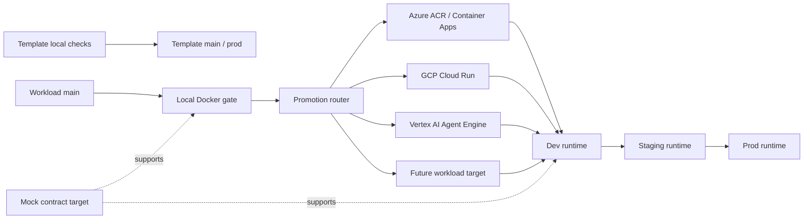

# Lifecycle Promotion Management

AgentArmy treats CI/CD as a promotion system, not a pile of unrelated deploy scripts. This standard has two lifecycle profiles:

- `template`: AgentArmy itself. It validates locally and promotes by merging to `main`; it is not a workload container.
- `platform-workload`: platform and spoke repositories that produce workload containers.

Platform workload repos should mirror the Postman environment model: `local`, `mock`, `dev`, `staging`, and `prod`. Dev is the active platform-development runtime where built containers first run as shared services.

## Promotion Model



The template lifecycle is:

| Stage | Purpose | Gate |
|---|---|---|
| `local` | AgentArmy docs, templates, hooks, and diagnostic checks on the developer machine or runner. | Doctor, docs build, script/parser checks. |
| `main` | Production-like source of truth for the AgentArmy template and docs site. | PR review and merge. |

The platform workload lifecycle is:

| Stage | Purpose | Gate |
|---|---|---|
| `local` | Trusted Docker proof on the operator PC or self-hosted runner. | Doctor, Docker build, CLI tests, smoke tests. |
| `mock` | Contract and simulation target for Postman, consumers, and generated examples. | OpenAPI/examples and mock behavior review. |
| `dev` | Active platform-development runtime where built containers first run as shared services. | Cloud build from promoted source ref. |
| `staging` | Production-like validation runtime. | Regression, contract, integration, and smoke checks. |
| `prod` | Production runtime. | Protected environment, rollback plan, observability check. |

`mock` is not in `promotion_order`; it is a parallel contract/simulation target.

## Branch And Ref Policy

Use source refs in workload repos to drive runtime environment promotion. Do not rely on mutable local images as lifecycle artifacts.

Recommended refs:

| Ref | Owner | Meaning |
|---|---|---|
| `main` | Engineering | Latest reviewed workload source. |
| `dev` or provider-specific `azure-dev` | Local Docker gate | Source approved for shared Dev runtime build. |
| `staging` | Release manager | Source approved for production-like validation. |
| `prod` or release tag | Release manager | Source approved for production. |

The local Docker gate may fast-forward the Dev source ref in the platform/spoke repo after tests pass. A promotion router then selects the target adapter for that workload. Later environments should use protected GitHub Environments, approvals, and release-manager ownership.

## Promotion Router

The promotion router decides where a validated workload goes next. It should read committed platform/spoke metadata, not personal workstation config.

Recommended manifest:

```text
.agent/promotion.json
```

Minimum shape:

```json
{
  "schema_version": "agentarmy.promotion.v1",
  "lifecycle_profile": "platform-workload",
  "service": "career-api",
  "default_target": "azure-container-apps",
  "dev_source_ref": "azure-dev",
  "promotion_order": ["local", "dev", "staging", "prod"],
  "simulation_targets": ["mock"],
  "targets": {
    "azure-container-apps": {
      "cloud": "azure",
      "build": "acr-task",
      "runtime": "container-apps"
    },
    "gcp-cloud-run": {
      "cloud": "gcp",
      "build": "cloud-build",
      "runtime": "cloud-run"
    },
    "vertex-agent-engine": {
      "cloud": "gcp",
      "build": "cloud-build",
      "runtime": "vertex-ai-agent-engine"
    }
  }
}
```

Allowed `lifecycle_profile` values are `template` and `platform-workload`. A `template` profile uses `promotion_order: ["local", "main"]` and must not declare container runtime adapters. A `platform-workload` profile uses `promotion_order: ["local", "dev", "staging", "prod"]` and may declare `simulation_targets: ["mock"]`.

The router may start simple: a workflow input or repo variable chooses the target. As the platform grows, the doctor CLI can read `.agent/promotion.json` and report the configured lifecycle target in `doctor.v1`.

## Target Adapters

Each target adapter owns only the cloud-specific handoff after local gates pass.

| Target | Build handoff | Runtime handoff |
|---|---|---|
| Azure Container Apps | ACR Task watches promoted branch. | Container Apps revision update. |
| GCP Cloud Run | Cloud Build watches promoted branch or reusable workflow builds from ref. | Cloud Run deploy. |
| Vertex AI Agent Engine | Cloud Build/package step builds the agent container or package. | Agent Engine deploy/update. |
| Future targets | Adapter-defined source or artifact handoff. | Adapter-defined deploy. |

Provider-specific adapters should keep secrets in cloud or GitHub environment configuration. The local gate should not carry provider keys beyond what is required to promote the source ref.

## Local Docker Gate

The local Docker gate is first-class. It is allowed to block Dev promotion.

It must:

- run on a trusted self-hosted runner labeled `docker-local`
- build the platform/spoke image from the merged source
- run `agentarmy-doctor`
- run service-specific CLI tests
- run local smoke tests with Docker or Compose
- publish artifacts and logs
- promote only the configured Dev source branch after all checks pass

It must not:

- run untrusted fork code
- push a local image as the canonical shared Dev artifact
- skip tests because a cloud build will run later
- promote multiple runtime refs in one job

## Cloud Build Gate

The cloud Dev build should build from the promoted source ref. For Azure, use Azure Container Registry Tasks watching the Dev branch. For GCP, use Cloud Build or the existing Cloud Run template. For Vertex AI Agent Engine, use the platform's supported container/package deployment path behind a dedicated adapter. For AWS, use the equivalent CodeBuild/ECR path.

Cloud build owns:

- reproducible image build from source
- registry image tag creation
- provenance and build logs
- environment-specific deploy handoff

Local Docker owns:

- developer workstation/runtime proof
- early CLI and smoke test evidence
- branch promotion only after tests pass

## Required Evidence

Each promotion should leave evidence that another agent or human can inspect:

| Evidence | Source |
|---|---|
| Doctor JSON/Markdown | `tests/artifacts/doctor/` |
| Docker or Compose logs | Local runner artifact |
| CLI test output | Local runner artifact |
| Promoted branch/ref | Git history |
| Cloud build run ID | Registry or cloud build artifact |
| Runtime revision/URL | Deployment artifact |
| Mock contract evidence | Postman mock, collection, or exported examples |

## Spoke Template Files

Container-producing platform/spoke repos should include:

```text
.agent/layer.json
.agent/promotion.json
agentarmy.services.json
Dockerfile
compose.yaml
.env.example
.github/workflows/local-docker-gate-to-dev.yml
```

Azure Container Apps platform/spoke repos should also include:

```text
acr-task.yaml
scripts/azure/Configure-AcrBranchBuildTask.ps1
```

GCP Cloud Run platform/spoke repos may use:

```text
templates/gcp-cloud-run/
```

Vertex AI Agent Engine spokes should get their own adapter template before they are treated as production-ready lifecycle targets.

## Agent Ownership

| Concern | Owner lens |
|---|---|
| CI/CD mechanics | `devops-engineer` |
| Release stage policy and rollback | `deployment-engineer` |
| Cross-spoke train coordination | `release-manager` |
| Docker build and compose quality | `docker-expert` |
| Azure Container Apps and ACR | `azure-infra-engineer` |
| GCP Cloud Run or Vertex AI target | `gcp-infra-engineer` |
| Agent runtime packaging | `ai-engineer` or `llm-architect` |
| Runtime SLO and post-deploy checks | `sre-engineer` |

## Provider Implementations

Use [Azure Container Apps Dev Deploy](azure-container-apps-dev.md) for the Azure-specific implementation of this lifecycle. Use [GCP Container Pipeline](gcp-cloud-run-pipeline.md) for the Cloud Run implementation.

The important rule is provider-neutral: the local PC gates source promotion, then the selected cloud adapter builds or deploys from that promoted source.

## Postman Environment Mirror

Postman environments should mirror the platform workload lifecycle:

| Postman environment | Lifecycle meaning |
|---|---|
| `<product>-local` | Local runner, local API, or local dev server target. |
| `<product>-mock` | Contract/mock target; not a runtime promotion stage. |
| `<product>-dev` | Shared platform-development runtime. |
| `<product>-staging` | Production-like validation runtime. |
| `<product>-prod` | Production runtime. |

AgentArmy may include Postman examples that use this vocabulary, but those examples model platform APIs. They do not make the AgentArmy template itself a platform workload.
