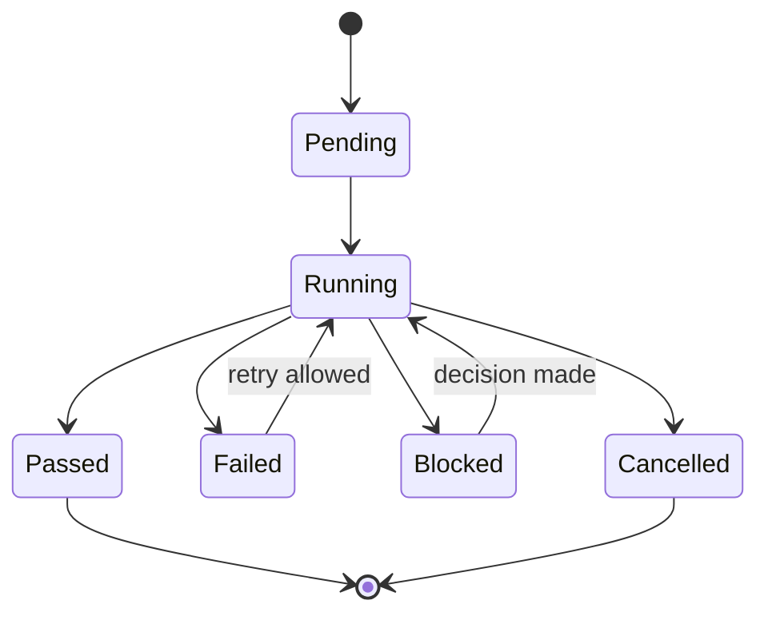
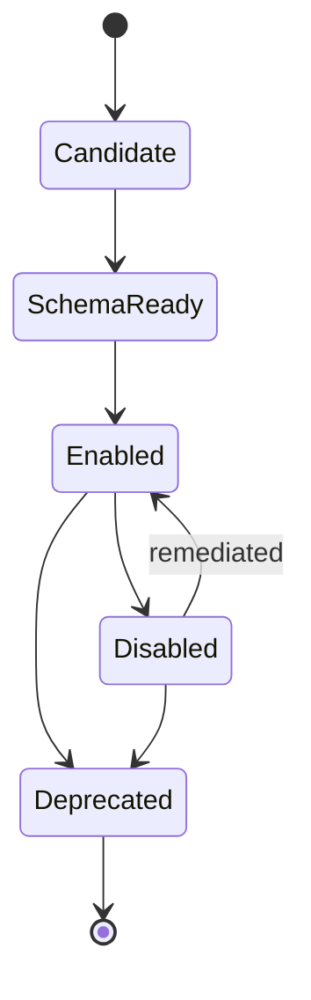

# Middle-Core Runbooks And Playbooks

Runbooks make failures operationally boring. Playbooks make useful platform behaviors repeatable.

Middle-core should select and execute runbooks through business objects, not raw provider errors. A failed ArcadeDB query, failed ingest, blocked work item, or unsafe MCP tool should become an affected object plus an evidence-producing workflow.

## Runbook Schema

```text
Runbook ID:
Trigger:
Severity:
Affected business objects:
Entry criteria:
Prechecks:
Automated steps:
Human approval points:
Compensation or rollback:
Evidence required:
Audit events emitted:
Success criteria:
Failure or escalation path:
Related playbooks:
```

## State Machines





## Runbooks

### RB-KNOW-001 - Failed Ingest Recovery

| Field | Value |
|---|---|
| Trigger | `knowledge-drop` fails or ingest job times out. |
| Affected objects | `knowledge-source`, `knowledge-chunk`, `capability-exercise`, `evidence-pack`. |
| Prechecks | Source type allowed, source size within limit, provider reachable, no quarantine policy. |
| Automated steps | Retry ingest once, re-read job status, collect logs, compute failure classification. |
| Human approval | Required before reprocessing quarantined or sensitive sources. |
| Evidence | Ingest status, failure reason, retry result, artifact refs, redaction status. |
| Success | Source returns to `searchable` or is safely marked `failed`. |
| Escalation | Create `decision-record` and `learning-signal` after repeated failure. |

### RB-KNOW-002 - Stale Embedding Reindex

| Field | Value |
|---|---|
| Trigger | Embedding model, chunking policy, or source version changes. |
| Affected objects | `knowledge-source`, `knowledge-chunk`, `knowledge-graph-snapshot`. |
| Prechecks | Source is not archived, tenant scope valid, model version approved. |
| Automated steps | Mark chunks stale, call backend-core reindex, refresh graph snapshot. |
| Evidence | Old/new model versions, chunk counts, search smoke result. |
| Success | Chunks return to `searchable` with current model version. |

### RB-CAP-001 - Capability Readiness Failure

| Field | Value |
|---|---|
| Trigger | Capability exercise fails after deploy, contract change, or scheduled check. |
| Affected objects | `capability-exercise`, `scenario-template`, `evidence-pack`, `tool-offering`. |
| Prechecks | Capability endpoint reachable, credentials configured, scenario contract valid. |
| Automated steps | Re-run once, collect metrics, compare last passing exercise, mark readiness degraded. |
| Human approval | Required before disabling a capability used by enabled tools. |
| Evidence | Scenario run, diagnostics, error envelope, diff from prior exercise. |
| Success | Capability becomes `ready` or visibly `degraded`. |

### RB-MCP-001 - Tool Promotion Checklist

| Field | Value |
|---|---|
| Trigger | Scenario is marked MCP-eligible. |
| Affected objects | `tool-offering`, `scenario-template`, `capability-exercise`, `decision-record`. |
| Prechecks | Input/output schemas exist, recent capability evidence exists, auth scopes declared. |
| Automated steps | Validate schemas, run unsafe input tests, verify redaction, generate descriptor draft. |
| Human approval | Required for first enablement and any guarded mutation. |
| Evidence | Schema validation result, policy result, promotion decision, audit event. |
| Success | Tool reaches `schema-ready` or `enabled`. |

### RB-MCP-002 - Emergency Tool Disable

| Field | Value |
|---|---|
| Trigger | Abuse signal, tool error spike, data leak concern, schema drift, or policy failure. |
| Affected objects | `tool-offering`, `decision-record`, `evidence-pack`. |
| Prechecks | Confirm tool ID, consumer scope, blast radius, replacement path. |
| Automated steps | Disable tool binding, notify consumers, run diagnostic capture. |
| Human approval | Required to re-enable. |
| Evidence | Disable event, reason, affected scenario, latest failed invocation. |
| Success | Tool is unavailable to MCP clients and audit explains why. |

### RB-WORK-001 - Evidence Gate Unsatisfied

| Field | Value |
|---|---|
| Trigger | Work packet attempts `done` transition without required evidence. |
| Affected objects | `work-packet`, `evidence-pack`, `decision-record`. |
| Prechecks | Work item type, risk class, required gates, linked PR/checks. |
| Automated steps | Import latest checks, reviews, artifacts; compute missing gate report. |
| Human approval | Required for waiver. |
| Evidence | Missing and satisfied gates, freshness, waiver decision if any. |
| Success | Work transitions to `done` or remains blocked with precise missing evidence. |

## Playbooks

### PB-001 - Prove New Knowledge Source Is Searchable

1. Run `knowledge-drop`.
2. Confirm `knowledge-source` is `searchable`.
3. Run `semantic-constellation` with a known query.
4. Attach graph snapshot and search result evidence.
5. Promote source to shared corpus only if redaction and evidence pass.

### PB-002 - Route Complex Task To Specialist Pod

1. Create or select a `work-packet`.
2. Validate Definition of Ready.
3. Run `agent-route-and-prove`.
4. Confirm selected owner, sidecars, gates, and policy version.
5. Track evidence until the work can move to review or done.

### PB-003 - Promote Read-Only Scenario To MCP

1. Confirm scenario has passing capability exercises.
2. Run `RB-MCP-001`.
3. Review schemas, auth scope, redaction, rate limits, and audit.
4. Enable read-only tool binding.
5. Monitor early tool runs and keep emergency disable ready.

### PB-004 - Recover Failed Scenario Run

1. Classify failure by scenario and affected business object.
2. Select matching runbook.
3. Execute safe automated remediation.
4. Re-run capability exercise.
5. Attach evidence and create learning signal if repeated.

## Automation Events

| Event | Typical handler |
|---|---|
| `knowledge_source.landed` | Start `knowledge-drop`. |
| `ingest_job.completed` | Assemble evidence and optionally run `semantic-constellation`. |
| `scenario.run.failed` | Select runbook by scenario and affected capability. |
| `capability_exercise.failed` | Run `RB-CAP-001`. |
| `tool_offering.schema_ready` | Start promotion review. |
| `mcp.tool_execution.failed` | Evaluate emergency disable. |
| `work_item.transition_requested` | Check evidence gates. |
| `evidence.requirement.satisfied` | Allow transition or promotion. |

## Implementation Direction

Add these contracts when the prototype grows beyond read models:

- `RunbookDefinition`
- `RunbookExecution`
- `PlaybookDefinition`
- `IncidentSignal`
- `RemediationAction`
- `CompensationStep`
- `ReadinessPosture`
- `ToolPromotionDecision`

These should be scenario-owned application use cases in middle-core, with provider actions behind ports.
