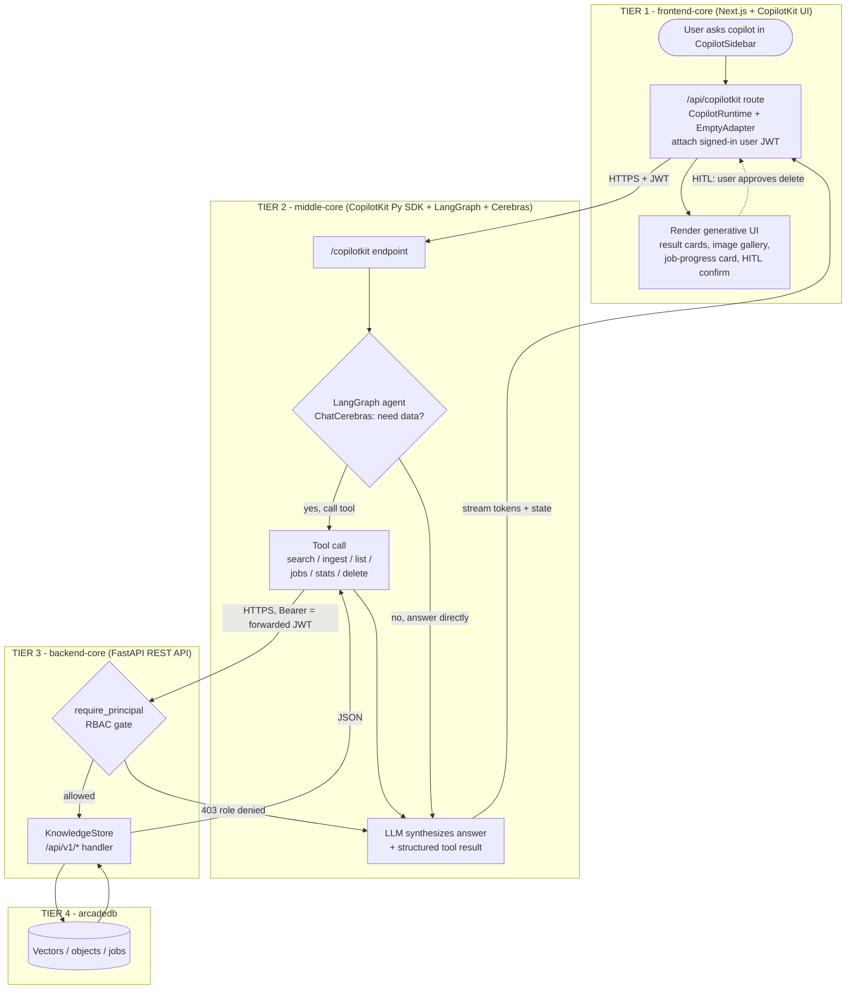

# CopilotKit + Generative UI Integration Plan (Four-Layer)

> **Status:** backlog plan (authored by the backend-core agent). Cross-layer initiative
> spanning `frontend-core`, `middle-core`, `backend-core`, `arcadedb`. Published here so all
> spoke agents can read it; tracked in the [backlog index](../../planning/backlog/BACKLOG_ISSUES_INDEX.md).

## Context

**Why:** We want an in-app AI copilot with generative UI across the product. Today the stack
has none: `backend-core` is a Python/FastAPI **knowledge-ingestion + cross-modal (text+image)
vector-search** API (ArcadeDB store, Cohere Embed v4 via Azure); the UI lives in
`frontend-core` (Next.js, App Router). There is **zero LLM/agent code** and **no
CORS/streaming** today. The architecture is organized into four named layers.

**Goal:** Add a CopilotKit-powered generative-UI layer, with the AI agent isolated in its own
**middle-core** layer so it never touches the database directly — `backend-core` stays the
single source of truth for data + RBAC.

**Decisions locked with the user:**
- **Four layers:** `frontend-core` / `middle-core` / `backend-core` / `arcadedb`.
- Runtime: **Python agent in `middle-core`** (CopilotKit Python SDK + LangGraph), calling
  `backend-core`'s REST contract as tools.
- LLM: **Cerebras** (`langchain-cerebras` `ChatCerebras`, OpenAI-compatible fallback).
- Frontend: **Next.js App Router**.

## What lives in each layer

| Layer | Tech | Responsibility | Holds (secrets/state) | Talks to |
|---|---|---|---|---|
| **frontend-core** | Next.js App Router + CopilotKit React | Chat UI + **generative-UI rendering**; thin `/api/copilotkit` runtime route (Empty adapter, no LLM); obtains user JWT | user session/JWT only | middle-core |
| **middle-core** | Python FastAPI + CopilotKit Py SDK + LangGraph + Cerebras | **Agent runtime**: hosts `/copilotkit`, decides + calls tools, runs the LLM; tools are HTTP calls to backend-core | Cerebras API key | backend-core |
| **backend-core** | Python FastAPI (this repo) | **Data API + authoritative RBAC**: search / ingest / jobs / sources / objects / stats / cockpit | DB creds, embed key | arcadedb |
| **arcadedb** | ArcadeDB | Vector index, stored object bytes, ingest-job records | the data | — |

**Boundary rules:** middle-core **never** imports `KnowledgeStore` or touches ArcadeDB — it
consumes `contracts/backend-core.openapi.json` over HTTP. The browser holds **no** LLM key
(Empty adapter). RBAC is enforced **once**, in backend-core; the user JWT flows
frontend-core → middle-core → backend-core unchanged.

## Activity diagram (runtime request flow)

## Generative-UI use cases (mapped to our domain)

1. **Conversational RAG search — "Ask your knowledge base."** `search` tool →
   `GET /api/v1/search`; answer with citations. Renders result cards, source chips, image
   thumbnails via `useCopilotAction({ render })`.
2. **Ingest assistant.** "Ingest this file/URL." → live **job-progress card** (polls
   `GET /api/v1/jobs/{id}`) via `useCoAgentStateRender`.
3. **Source management.** Selectable sources table; **deletes need admin + HITL confirmation**
   (`renderAndWaitForResponse`).
4. **Cockpit / analytics copilot.** Metrics cards / charts from read-only stats + cockpit.
5. **Cross-modal image exploration.** Image gallery from cross-modal hits.
6. **App-state actions & context.** `useCopilotAction` to navigate/filter; `useCopilotReadable`
   to share current filters/selected source.
7. **Contextual suggestions.** `useCopilotChatSuggestions` for page-aware prompt chips.

## middle-core — agent runtime (NEW)

**Dependencies:** `copilotkit`, `langgraph`, `langchain-core`, `langchain-cerebras`
(OpenAI-compatible fallback via `langchain-openai` → `https://api.cerebras.ai/v1`), `httpx`,
`fastapi`, `uvicorn`, `pyjwt`.

**Modules:**
- `llm.py` — `ChatCerebras(model=...)` factory from config.
- `backend_client.py` — async `httpx` client wrapping backend-core `/api/v1/*`; attaches the
  forwarded user JWT as `Authorization: Bearer`. (Optionally a typed client generated from
  `contracts/backend-core.openapi.json`.)
- `tools.py` — LangGraph tools (`search_knowledge`, `ingest_source`, `get_job_status`,
  `list_sources`, `delete_source`, `get_stats`, `cockpit_metrics`) delegating to
  `backend_client`. May pre-check roles for UX; **enforcement stays in backend-core**.
- `agent.py` — `create_react_agent(llm, tools)` named `knowledge_copilot`.
- `app.py` — FastAPI app; `CopilotKitRemoteEndpoint(agents=[LangGraphAgent(...)])`;
  `add_fastapi_endpoint(app, sdk, "/copilotkit")`; `CORSMiddleware` for the frontend origin;
  extract inbound JWT and inject into the LangGraph run config so tools forward it.

**Config / secrets** (mirror backend-core's secret-file pattern for `AZURE_EMBED_API_KEY`):
`CEREBRAS_API_KEY` (env or mounted file), `CEREBRAS_MODEL` (default `llama-3.3-70b`),
`CEREBRAS_BASE_URL`, `BACKEND_CORE_URL`, `CORS_ORIGINS`.

**Cerebras caveats:** confirm the model supports tool calling; mitigate the known
empty-`content` tool-call bug (ensure non-empty assistant content / keep the OpenAI-compatible
fallback); trim RAG context for Cerebras context/rate limits.

## backend-core — minimal change

- Add `CORSMiddleware` (currently absent) allowing the middle-core origin — config-driven
  (`CORS_ORIGINS`).
- Confirm `require_principal` (`app/auth.py`) accepts the **forwarded** JWT unchanged — no new
  auth code; backend-core remains the authoritative RBAC gate (search=reader,
  ingest=contributor, delete=admin).
- **No agent code, no contract change.** `/copilotkit` lives in middle-core, so
  `scripts/export_openapi.py` + the CI drift check stay green.

**Reused (do not reimplement):** `app/auth.py`, `KnowledgeStore`, existing `/api/v1/*` routes
in `app/main.py`, config + secret loading in `app/config.py`.

## frontend-core — Next.js App Router

- **Deps:** `@copilotkit/react-core`, `@copilotkit/react-ui`, `@copilotkit/runtime`.
- **Runtime route** `app/api/copilotkit/route.ts`: `CopilotRuntime({ remoteEndpoints:
  [{ url: <middle-core>/copilotkit }] })` + `ExperimentalEmptyAdapter` +
  `copilotRuntimeNextJSAppRouterEndpoint`; **forward the signed-in user's JWT** to middle-core.
- **Provider:** wrap the App Router layout in `<CopilotKit runtimeUrl="/api/copilotkit"
  agent="knowledge_copilot">` with auth headers.
- **UI:** global `CopilotSidebar`/`CopilotPopup`; inline `CopilotChat` on search. Implement
  the seven use cases with the named hooks.

## Security & guardrails

- **RBAC single-sourced in backend-core**; JWT flows through all layers unchanged.
- **Destructive ops** (`delete_source`) require admin **and** HITL confirmation.
- **Cockpit:** middle-core exposes only **predefined, parameterized** metrics tools — never
  model-authored free-form SQL.
- **CORS** locked per layer; no LLM key in the browser; no DB creds in middle-core; reuse
  secret-file mounting; never log secrets.

## Deployment / orchestration

- Add a `middle-core` service to `docker-compose.yml` (depends on backend-core + arcadedb;
  `BACKEND_CORE_URL` points at the backend-core service). Note follow-up for `deploy/` (Bicep).

## Phased rollout

- **Phase 0 (spike):** middle-core `/copilotkit` with one `search` tool → read-only sidebar in
  frontend-core, end-to-end against backend-core.
- **Phase 1:** RAG search copilot with citation generative UI.
- **Phase 2:** ingest assistant + job-progress generative UI.
- **Phase 3:** source management + HITL deletes.
- **Phase 4:** cockpit analytics, cross-modal gallery, suggestions, app-state actions.

## Verification

- **middle-core:** `pytest` — `/copilotkit` requires a bearer token; tools forward the JWT;
  agent + tool registration smoke test with a **mocked** LLM and **mocked** backend-core
  client (no live Cerebras/backend calls in CI).
- **backend-core:** existing `pytest tests/ -v` green; verify CORS + that a forwarded token is
  accepted and a `reader` token is blocked from ingest/delete.
- **Local E2E:** `docker-compose up` (arcadedb + backend-core + middle-core) with
  `CEREBRAS_API_KEY` set; `POST /api/v1/ingest` a sample doc; drive the agent (frontend-core or
  a script hitting middle-core `/copilotkit`) to ask a question → confirm `search` fires
  against backend-core and cites the chunk; confirm a `reader` user is denied ingest/delete.
- **frontend-core:** dev server → open sidebar, ask a question (citations render), test ingest
  job-progress card, test delete HITL confirmation.

## Repo & session scope

`middle-core` and `frontend-core` are **separate repositories**. The backend-core agent that
authored this plan could directly implement only the small **backend-core** changes (CORS +
config); the middle-core and frontend-core sections are the agreed design to build in their own
repos. This is a candidate to hand off as an [epic](../../.github/ISSUE_TEMPLATE/epic-handoff.md)
into each spoke.

## Critical files

- **middle-core (new, separate repo):** `{app,agent,tools,llm,backend_client}.py`,
  `requirements.txt`, `Dockerfile`, `tests/test_copilot.py`. Consumes
  `backend-core`'s `contracts/backend-core.openapi.json`.
- **backend-core (edit there, small):** `app/main.py` (CORS), `app/config.py` + `.env.example`
  (`CORS_ORIGINS`); reuse `app/auth.py`, `KnowledgeStore`. (Add a `middle-core` entry to
  `docker-compose.yml` only if we co-orchestrate locally.)
- **frontend-core (separate repo, documented):** `package.json`,
  `app/api/copilotkit/route.ts`, `app/layout.tsx` (provider), search/ingest/sources/cockpit
  pages + generative-UI components.
