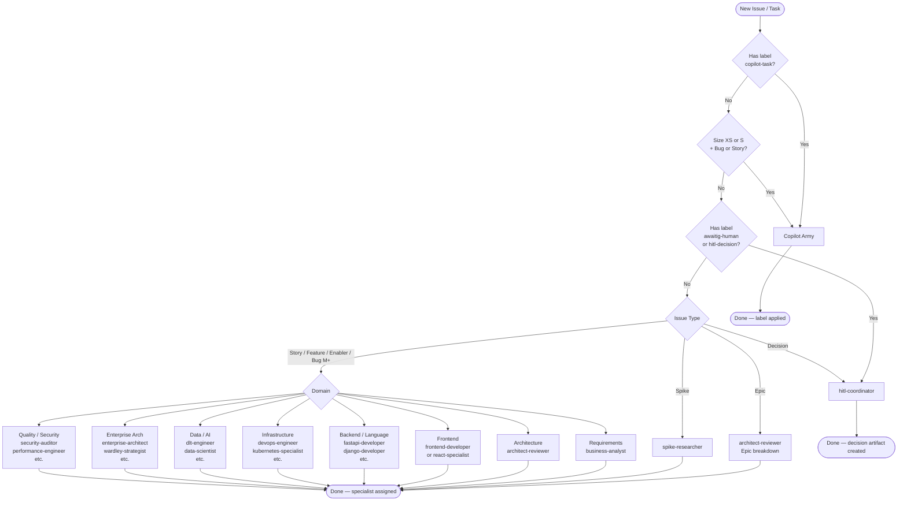

# Routing Decision Tree

How AgentArmy routes work items to the right army and agent — deterministically, testably, and with a full audit trail.

## Concept

AgentArmy coordinates ~180 specialist agents across two armies. Historically, routing was encoded as a prose table in [CLAUDE.md](../CLAUDE.md). That table is accurate but not executable: you cannot test it, detect conflicts automatically, or verify that a given task routes to the expected agent.

The **Routing Policy Engine** solves this by expressing every routing rule as a machine-readable YAML policy in `.github/routing-policy.yaml`. Rules are:

- **Deterministic**: given the same input, the same rule always wins
- **Testable**: the validator runs 34+ test cases on every PR that touches routing
- **Auditable**: every rule has a `rationale` and `example` field
- **Conflict-checked**: the validator flags any two rules at the same priority that route to different armies

CLAUDE.md remains the authoritative human-readable reference. The YAML policy is the executable projection of it.

## Top-Level Decision Flow



## How Rules Are Evaluated

Rules in `.github/routing-policy.yaml` are sorted by ascending `priority` (lower number = higher priority). The **first matching rule wins** — there is no fall-through.

A rule matches when ALL of these hold:
1. If `conditions.issue_types` is set, the input `issue_type` must be in the list
2. If `conditions.size` is set, the input `size` must be in the list
3. If `conditions.labels` or `conditions.keywords` are set, at least one label must match the input labels **or** at least one keyword must appear (case-insensitive substring) in the input title/body

## Rule Schema

```yaml
- id: "unique-kebab-case-id"          # required, unique across all rules
  priority: 100                        # required, integer; lower = evaluated first
  army: copilot | claude_code          # required
  agent: agent-name | null             # null means army-level routing (no specific agent)
  skill: skill-name                    # optional; slash command skill to invoke
  conditions:
    labels: [label-a, label-b]         # ANY of these GitHub labels
    issue_types: [story, bug, spike]   # epic | feature | story | enabler | bug | spike | decision
    size: [XS, S, M, L, XL]           # T-shirt size labels
    keywords: [keyword-a, keyword-b]   # case-insensitive substring match on title + body
    concern: "Human-readable summary"  # informational only, not used for matching
  rationale: "Why this rule exists"    # required; documents the routing decision
  example: "Example trigger scenario"  # required; concrete usage example
```

### Priority bands

| Band | Range | Purpose |
|------|-------|---------|
| Copilot triggers | 10–35 | Label-based Copilot routing and PR review |
| HITL escalation | 40–42 | Decision artifacts and blocked issues |
| Meta-orchestration | 50–52 | Agent governance, error escalation |
| Planning | 100–102 | Requirements, sprint planning, Epic breakdown |
| Architecture | 110–112 | ADRs, security audits, API design |
| Frontend | 119–127 | React, Next.js, Vue, Angular, mobile web |
| Backend | 130–136 | FastAPI, Django, Spring Boot, microservices |
| Language specialists | 140–150 | Python, Go, Rust, Java, TypeScript, etc. |
| Platform specialists | 160–163 | .NET Core, .NET Framework, PowerShell |
| Mobile | 170–173 | React Native, Flutter, native iOS/Android |
| Infrastructure | 180–190 | DevOps, Kubernetes, Terraform, cloud |
| Quality & Security | 200–210 | Performance, contract testing, schema migration |
| Data & AI | 220–225 | dlt, data warehouses, ML engineering |
| Enterprise Architecture | 230–240 | TOGAF, Wardley, regulatory compliance |
| Developer Experience | 250–255 | Docs, DevRel, refactoring, legacy modernisation |
| Business & Product | 260–262 | PM, UX research, scrum |
| Research | 270–272 | Competitive analysis, market research |
| Cross-cutting clusters | 300–312 | Contract cluster, delivery/ops cluster tiebreakers |
| Size fallbacks | 900–902 | Last-resort size-only routing |

## Adding or Modifying Rules

### Adding a new rule

1. Open `.github/routing-policy.yaml`
2. Find the appropriate priority band for the domain
3. Add the rule with all required fields:

```yaml
- id: my-new-rule
  priority: 155          # choose a gap in the right band
  army: claude_code
  agent: my-new-agent
  conditions:
    labels: [my-label]
    keywords: ["specific multi-word keyword", "another keyword"]
    concern: "What domain this covers"
  rationale: "Why this agent owns this concern"
  example: "Concrete scenario that triggers this rule"
```

4. Add a test case to `tools/validate-routing.mjs` in the `TEST_CASES` array:

```javascript
{
  description: 'my-label routes to my-new-agent',
  input: { labels: ['my-label'], title: 'Do something specific' },
  expected_army: 'claude_code',
  expected_agent: 'my-new-agent',
},
```

5. Run `node tools/validate-routing.mjs` locally — it must exit 0 before pushing.

### Keyword hygiene rules

To avoid false-positive substring matches:

- **Prefer multi-word phrases** over single words: `"Django ORM"` not `"ORM"` (matches "terraform")
- **Avoid generic words**: `"service"`, `"pipeline"`, `"architecture"`, `"platform"` by themselves
- **Test for substrings**: before adding a keyword, check `echo "your keyword" | python3 -c "import sys; print('orm' in sys.stdin.read().lower())"` — if a common word contains your keyword as a substring, make it more specific

### Modifying an existing rule

1. Change the YAML
2. Run `node tools/validate-routing.mjs` — the test harness will catch regressions
3. If a test case now fails and the new behaviour is correct, update the test case too

### Changing rule priority

If two rules conflict (one fires when the other should), adjust priority:
- Lower number = evaluated first = wins
- Leave gaps between rules in the same band (e.g., 119, 120, 121) so you can insert without renumbering

## Validator

### Running locally

```bash
# Requires Python 3 with pyyaml and Node.js 18+
pip install pyyaml
node tools/validate-routing.mjs
```

Output:
```
═══════════════════════════════════════════════════════════════════
  AgentArmy Routing Policy Validator
═══════════════════════════════════════════════════════════════════

▶ Loading and parsing routing-policy.yaml ...
[OK]    Parsed .github/routing-policy.yaml
[OK]    Found 114 rules, version 1.0

▶ Validating rule schema ...
[OK]    All rules pass schema validation

▶ Checking for duplicate rule IDs ...
[OK]    All 114 rule IDs are unique

▶ Detecting cross-army conflicts ...
[OK]    No cross-army conflicts at the same priority

▶ Checking routing ambiguity rate ...
[OK]    Ambiguity rate: 0% (within 5% threshold)

▶ Running routing test cases ...
[OK]    PASS [copilot-xs-bug] XS bug → Copilot
...

  Status:    PASS
```

### What the validator checks

| Check | Description | Failure means |
|-------|-------------|---------------|
| Schema validation | All required fields present, valid enum values | Rule is malformed |
| Duplicate IDs | Every rule ID is unique | Two rules have the same ID |
| Cross-army conflicts | No two rules at the same priority route to different armies when conditions overlap | Routing is non-deterministic |
| Ambiguity rate | < 5% of rule pairs at the same priority are ambiguous | Too many overlapping same-army rules |
| Test harness | All test cases route to the expected army/agent | A change broke an existing routing path |

### Exit codes

- `0` — all checks pass
- `1` — one or more checks failed (CI will block the PR)

## CI Integration

The workflow `.github/workflows/validate-routing.yml` runs automatically on every PR or push that touches:

- `.github/routing-policy.yaml`
- `tools/validate-routing.mjs`
- `.github/workflows/validate-routing.yml`

The workflow installs pyyaml via pip and runs `node tools/validate-routing.mjs`. A non-zero exit code fails the PR check.

## Relationship to CLAUDE.md

`.github/routing-policy.yaml` is the **executable projection** of the routing table in [CLAUDE.md](../CLAUDE.md).

- **CLAUDE.md** is the authoritative human prose source — it explains intent, examples, and nuance
- **routing-policy.yaml** is the machine-readable form — it is what the validator and any future automation reads
- **They must stay in sync** — when you update CLAUDE.md's routing table, update the YAML and vice versa

If you are unsure which is correct, trust CLAUDE.md for intent and update the YAML to match.

## Further Reading

- [CLAUDE.md — Route work to the right army](../CLAUDE.md#route-work-to-the-right-army-first-then-the-right-agent)
- [docs/routing-matrix.md](routing-matrix.md) — Detailed routing matrix by domain
- [docs/agents.md](agents.md) — Full agent roster
- [docs/language-routing.md](language-routing.md) — Language specialist routing guide
- [.claude/agents/categories/02-language-specialists/TAXONOMY.md](../.claude/agents/categories/02-language-specialists/TAXONOMY.md) — Language/framework/platform routing taxonomy
