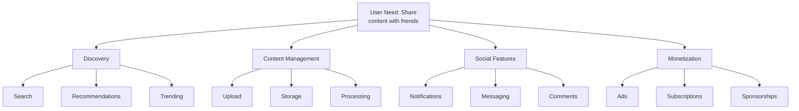

# Wardley Maps in AgentArmy

Strategic mapping of competitive landscapes and organizational positioning using Wardley analysis.

## What is a Wardley Map?

A Wardley Map visualizes four key dimensions of strategy:

1. **User Needs** — What the user fundamentally wants
2. **Value Chain** — Components/capabilities required to meet needs
3. **Evolution** — Where each component sits in its lifecycle (Genesis → Commodity)
4. **Doctrine** — Universal principles guiding decisions
5. **Climate** — External forces shaping strategy

## Generating Wardley Maps

Use the `/wardley` skill in Claude Code to automatically generate strategic analysis:

```bash
/wardley social media platform
/wardley fintech payment system
/wardley enterprise software infrastructure
```

## Example: Social Media Platform

### Value Chain Decomposition



### Evolution Positioning

```
Genesis        Custom         Product        Commodity
(Novel)        (Bespoke)      (Packaged)     (Utility)
   |              |               |              |
   v              v               v              v

        Recommendation Engine
        (Differentiation)
        
                                Upload (HTTP)
                                Storage (AWS S3/GCS)
                                Compute (Kubernetes)
                                Database (PostgreSQL)
```

## Key Strategic Insights

### Doctrine Alignment
- **Focus on user outcomes** — Engagement metrics
- **Know your users** — Behavior patterns, demographics
- **Understand competition** — TikTok, Instagram, Threads
- **Design for ubiquity** — Cross-platform, accessibility
- **Embrace new technologies** — ML recommendations, video

### Competitive Climate
- **Regulation** — Data privacy (GDPR, CCPA), child safety
- **Market Competition** — TikTok dominance, Instagram decline
- **Technology Shift** — AI-driven recommendations, video-first
- **User Behavior** — Declining text, rising video, ephemeral content
- **Monetization** — Ad market consolidation, subscription adoption

## Strategy Recommendations

### Invest in Commodity
- Migrate custom infrastructure to cloud (Genesis → Commodity)
- Use managed PostgreSQL, S3, Kubernetes instead of self-managed
- Focus engineering on differentiation, not infrastructure

### Differentiate at the Edge
- **Recommendation algorithm** — Proprietary, ML-driven
- **User experience** — Fast, intuitive, mobile-first
- **Community features** — Unique interactions, creator tools
- **Safety & moderation** — AI-powered, fast response

### Consolidate & Reduce Complexity
- **Monolith** (Genesis) → Microservices (Custom) → Serverless (Product)
- **In-house ML** → Use CloudML, Vertex AI, SageMaker (Commodity)
- **Custom indexing** → Elasticsearch, OpenSearch (Product)

---

## Using Wardley Maps in AgentArmy

### For Architecture Decisions
1. Run `/wardley [domain]` to analyze landscape
2. Identify commodity vs. custom components
3. Document decision in Architecture Decision Record (ADR)
4. Reference Wardley analysis in rationale

### For Roadmap Planning
1. Map current state (what we have)
2. Map desired state (where we're going)
3. Identify gaps and investments needed
4. Prioritize based on strategic importance + evolution gap

### For Competition Analysis
1. Map competitor value chains
2. Identify differentiation points
3. Find commodity shifts creating opportunity
4. Anticipate future moves

## Ward

ley Map Example: Data Pipeline Architecture

```
User Need: Transform raw data into insights
    |
    v
Components:
- Data Extraction (APIs)        → Product/Commodity (dlt, Fivetran)
- Data Storage (Data Lake)      → Product/Commodity (S3, GCS)
- Data Warehouse (Analytics)    → Product (Snowflake, BigQuery)
- Transformation (ETL/ELT)      → Custom (dbt, Airflow)
- Visualization (BI)            → Product (Looker, Tableau)
- ML Models (Predictions)       → Custom (scikit-learn, TensorFlow)

Strategy:
- Use commodity extraction tools (dlt)
- Use managed data warehouse (BigQuery)
- Build custom transformations (dbt)
- Buy BI tool, don't build
```

## Creating Your Own Wardley Map

### Step 1: Define User Need
```
What does the user fundamentally want?
Example: "Share photos with friends"
```

### Step 2: List Value Chain
```
User Need
├── Photo Capture
├── Upload
├── Storage
├── Discovery
├── Sharing
└── Monetization
```

### Step 3: Position on Evolution
```
Genesis (Invent)  → Custom (Build)  → Product (Consume)  → Commodity (Integrate)
```

### Step 4: Assess Doctrine
- User outcomes over features
- Know your competitive landscape
- Invest in differentiation, commodity outsource

### Step 5: Analyze Climate
- Regulatory environment
- Technological shifts
- Market competition
- User behavior changes

## Resources

- **[Wardley Mapping](wardley.md)** — Complete guide
- **[Capability Maps](capability-maps.md)** — Business capability modeling
- **[Architecture Decisions](architecture-decisions.md)** — Documenting strategic choices
- **[Wardley Mapping](https://learnwardleymapping.com/)** — Official resource
