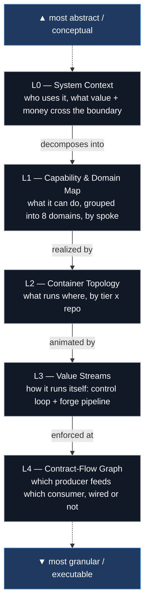

# 🗺 Architecture Atlas — Conceptual → Contract

**🧭 [[Platform Atlas]] · 🎛 [[Obsidian Board]] · 🏠 [[Welcome]]**

> [!abstract] Purpose
> A single **top-down descent** through the Untool.ai / AgentArmy architecture — from the outermost conceptual frame (who pays, what value crosses the boundary) down to the enforceable contract surface (which producer feeds which consumer, and is it wired yet). Each level **decomposes the one above** and spans the same domains at finer granularity. Where [[Platform Atlas]] navigates by *layer* (UI / API / Worker / Data / Infra), this atlas navigates by *abstraction level* — the two are orthogonal and complementary.

## The stack

## The five levels

| Level | View | What it answers | Diagram |
|---|---|---|---|
| **L0** | [[L0 — Untool.ai System Context]] | Who uses the platform, what they get, how value + money cross its boundary | C4-Context flowchart |
| **L1** | [[L1 — Capability & Domain Map]] | What the platform can do, grouped into 8 domains, which spoke realizes each | Capability map (subgraph per domain) |
| **L2** | [[L2 — Container Topology (Tier x Repo)]] | What runs where — every container by ARC-ADR-023 tier and owning repo | C4-Container flowchart |
| **L3** | [[L3 — Value Streams (Control Loop & Forge Pipeline)]] | How the platform runs itself — the two-army control loop + the ontology→code forge pipeline | Two process flowcharts |
| **L4** | [[L4 — Contract-Flow Graph]] | Which producer feeds which consumer, and whether the edge is shipped / proposed / to-wire | Producer→consumer graph + status table |

## How to read it

Start at the level that matches your question and **descend for granularity**: L0 when you're explaining the bet to someone new; L1 when you're scoping investment across domains; L2 when you're deciding what deploys together; L3 when you're reasoning about how work and models flow through the system; L4 when you're wiring an actual integration. Each level is a faithful decomposition of the one above — the four L0 audiences reappear as L1 domains, which are realized by L2 containers, animated by L3 value streams, and made executable by L4 contracts. The same domains recur at every level; only the resolution changes.

## Mapping to frameworks (for the EA)

| This atlas | C4 | TOGAF ADM domain |
|---|---|---|
| L0 System Context | Level 1 — System Context | Architecture Vision (Phase A) |
| L1 Capability & Domain | — (capability model) | Business Architecture (Phase B) — capability map |
| L2 Container Topology | Level 2 — Container | Technology Architecture (Phase D) |
| L3 Value Streams | — (dynamic / process) | ADM process + value-stream mapping |
| L4 Contract-Flow | Level 3 — Component / interface | Application & Integration Architecture (Phase C) |

> [!tip] Keeping it alive
> These are **content-true** snapshots (2026-05-28): L2 reflects the 13 `image.json` manifests, L4 reflects every row of `docs/contracts.md`. When a container or contract changes, re-derive the affected level — the fleet heartbeat already inventories both, so drift is detectable. Don't let the diagram age silently past the registry it depicts.

---

Related: [[Platform Atlas]] · [[API Strategy — Internal, External, Open & Monetized]] · [[Contract Backlog 2026-05-27]] · [[Model-Driven Platform]] · [[Ontology-Pipeline]]
