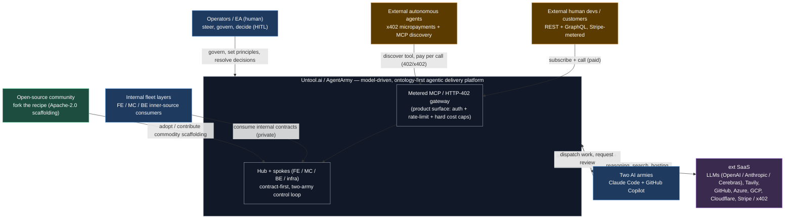

# L0 — Untool.ai System Context

**🗺 [[Architecture Atlas — Conceptual to Contract]] · 🧭 [[Platform Atlas]] · ⬇ [[L1 — Capability & Domain Map]]**

> [!abstract] What this view answers
> *Who uses the platform, what they get, and how value (and money) crosses its boundary.* This is the highest-abstraction view in the atlas — one system, its actors, and its external dependencies. Everything below it (capabilities, layers, contracts) decomposes this single box.

## System context

> [!note] Legend
> Blue = internal / inner-source · Green = open-source community · Amber = external commercial (paying) · Purple = external SaaS dependency · Grey = the platform system + its gateway product surface.

## The bet, stated as architecture

**Value proposition.** Untool.ai is "a platform that helps build platforms" — a model-driven, ontology-first, agentic software-delivery system. A canonical model and ontology drive many projections (UI, contracts, code, skills, knowledge graph); two autonomous AI armies build and govern those projections through a hub-and-spoke topology coordinated on a shared board. The productized form is **Untool.ai**; **AgentArmy** is the running implementation.

**Four audiences, one discipline.** The same contract-first / mock-first discipline serves four distinct consumer classes whose *governance, visibility, and economics* differ: **internal plumbing** (private inter-layer contracts), **inner-source** (fleet agents and teams reusing shared contracts and building blocks), **open-source** (commodity scaffolding the world can fork), and **external commercial** (gated, metered consumers). The L0 boundary makes those four explicitly visible because they pull the architecture in four different directions.

**Monetization is the organizing constraint; security is the enabling gate.** The differentiated bet is *agent-native, pay-per-call* access — capabilities wrapped as **MCP servers behind an HTTP-402 / x402 metered gateway** so external autonomous agents discover a tool, receive a price, pay, and call ("agents that pay agents"). That gateway is the product, and it dictates the architecture rather than bolting on at the end. Security is the prerequisite, not a polish step: exposing LLM / UDA / agent compute to the world demands auth, per-principal rate limits, and **hard cost caps** — the named threat is **Denial of Wallet** (cost-asymmetry abuse from a single caller). Stripe meters human/dev customers; x402 settles autonomous-agent micropayments; both reconcile at the gateway.

**The open-core boundary.** The system deliberately splits what crosses the boundary as open versus operated: **open the recipe** — the template hub, agent definitions, runner infra, and contract-first tooling (Apache-2.0 / MIT, never source-available) to win adoption and trust; **sell the kitchen** — the live Universal Data Adapter, the hosted reasoning / ontology engine, and the agent runtime-as-a-service, i.e. everything that costs compute, LLM, or data spend to operate. The open-source community and the external commercial actors sit on opposite sides of that line, both visible at this level.

---

Related: [[API Strategy — Internal, External, Open & Monetized]] · [[Platform Atlas]] · [[Architecture Atlas — Conceptual to Contract]] · [[L1 — Capability & Domain Map]]
