# L2 — Container Topology (Tier × Repo)

**🗺 [[Architecture Atlas — Conceptual to Contract]] · ⬆️ [[L1 — Capability & Domain Map]] · ⬇️ [[L3 — Value Streams (Control Loop & Forge Pipeline)]] · 🛡️ [[Layer — Infra]]**

> [!abstract] Scope
> A C4 **container view** of the AgentArmy fleet: every runtime container, grouped by **tier** ([[ARC-ADR-023]]) and annotated with its **owning repo** (`hub` · `FE` · `MC` · `BE`). What runs where, who builds it, and where it deploys.

```mermaid
flowchart TB
    classDef stateful fill:#1b3a4b,stroke:#4fc3f7,stroke-width:2px,color:#e3f2fd
    classDef statelessApp fill:#1b3b2f,stroke:#66bb6a,stroke-width:2px,color:#e8f5e9
    classDef function fill:#3a2f1b,stroke:#ffb74d,stroke-width:2px,color:#fff3e0
    classDef planned fill:#2a2a2a,stroke:#9e9e9e,stroke-width:1.5px,stroke-dasharray:5 4,color:#cfcfcf

    subgraph PLATFORM["Platform tier — stateful, slow lifecycle (composed via templates/local-stack/)"]
        direction LR
        arcadedb["agentarmy-arcadedb (hub)<br/>graph+document DB"]
        fuseki["agentarmy-fuseki-ontology (hub)<br/>RDF / SPARQL reasoning store"]
        postgres["Postgres (hub, pulled image)<br/>DBOS system + app DB"]
        nats["NATS JetStream (hub, pulled image)<br/>CloudEvents event bus"]
    end

    subgraph APPLICATION["Application tier — stateless, one container per spoke, rolling deploys"]
        direction LR
        backendCore["backend-core (BE)<br/>FastAPI + DBOS — manifest shipped"]
        middleCore["middle-core (MC)<br/>manifest pending"]
        frontendCore["frontend-core (FE)<br/>manifest pending"]
    end

    subgraph FUNCTION["Function tier — stateless, fast, independently rolled out (hub-authored, spoke-reused)"]
        direction LR
        eventBridge["agentarmy-event-bridge (hub)<br/>HTTP↔NATS bridge, HMAC verify"]
        forge["agentarmy-forge (hub)<br/>ontology→code generator"]
        hmacVerify["agentarmy-hmac-verify (hub)<br/>sidecar — HMAC verifier"]
        jwtIntrospect["agentarmy-jwt-introspect (hub)<br/>sidecar — JWT verify (ADR-002)"]
        embedder["agentarmy-local-embedder (hub)<br/>FastAPI embeddings (NPU/iGPU)"]
        otel["agentarmy-otel-collector (hub)<br/>sidecar — OTel collector"]
        migrator["agentarmy-schema-migrator (hub)<br/>init-container — alembic + DDL"]
        llmGateway["agentarmy-llm-gateway (BE)<br/>OpenAI-compatible gateway"]
    end

    note["All containers deploy → ACA (Azure Container Apps)"]

    class arcadedb,fuseki,postgres,nats stateful
    class backendCore statelessApp
    class middleCore,frontendCore planned
    class eventBridge,forge,hmacVerify,jwtIntrospect,embedder,otel,migrator,llmGateway function
    class note planned

    %% representative dependencies (not exhaustive)
    backendCore -.reachable.-> arcadedb
    backendCore -.reachable.-> postgres
    migrator -.init before.-> backendCore
    eventBridge -.publishes.-> nats
```

> [!note] Legend
> 🟦 **stateful** (platform) · 🟩 **stateless** (application) · 🟧 **function/sidecar** · ⬛ dashed = **manifest-pending** (planned). Repo owner in `(…)`. Pulled platform images (Postgres, NATS) are hub-composed in `templates/local-stack/`, not hub-authored manifests. All targets = **ACA**. `fake-platform-image` / `fake-application-image` are BE **test fixtures** and are excluded.

## The tiering rule

Per [[ARC-ADR-023]], a **container is the unit of independent rollout and isolated failure**, so the placement test is sharp: *two pieces belong in the same container iff (a) they always deploy together AND (b) one failing must take the other down anyway.* Everything else splits. This is what keeps a spoke from collapsing into a "fusion image" (now formally retired) and equally stops the team from pre-splitting a single spoke into twelve micro-containers it has no operational need to coordinate. The decision driver underneath is small-team economics: distributed tracing, deploy choreography, and cross-service schema versioning are real recurring costs a 1–2 person fleet pays twice.

## The stateful / stateless boundary

The hard line in this view is **state**. The **Platform tier** owns everything that persists to disk — ArcadeDB (graph+document), Fuseki (RDF/SPARQL), Postgres (DBOS system + app DB), and the NATS JetStream event bus — and therefore moves on a slow, careful lifecycle with one shared instance per environment (not one per spoke). The **Application** and **Function** tiers are strictly stateless: if a function needs persistence it *depends on* a platform container rather than embedding one. Ownership follows the same seam — the hub owns all platform deployables end-to-end (Dockerfile, manifest, deploy lane), and spokes consume the running instance via env (`ARCADEDB_URL`, `POSTGRES_URL`, `NATS_URL`, `FUSEKI_URL`) rather than vendoring `templates/*-image/`.

## Current reality and composition patterns

Today the fleet's centre of gravity is the **function tier**: eight hub-authored sidecars/functions (event-bridge, forge, hmac-verify, jwt-introspect, local-embedder, otel-collector, schema-migrator, plus BE's llm-gateway) are built once in the hub and reused across every spoke — exactly the leverage a "platform that builds platforms" is meant to provide. The **application tier** is where the gap shows: CLAUDE.md and ADR-023 both define it as "one container per spoke — backend-core, middle-core, frontend-core," but only **backend-core has shipped an `image.json`**. FE and MC are drawn here as planned application spokes (**manifest-pending**, dashed) — their containers are real architectural commitments awaiting a manifest, not speculation. Finally, **sidecar** (hmac-verify, jwt-introspect, otel-collector — companion containers sharing a network namespace) and **init-container** (schema-migrator running to completion before backend-core starts) are *composition patterns, not new tiers*: they are how function-tier containers attach to a spoke, which is why they live under Function above rather than as a fourth band.
