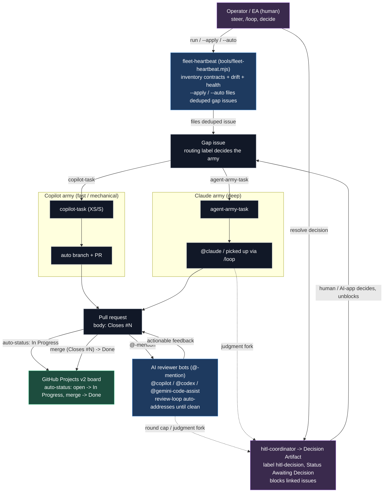

# L3 — Value Streams (Control Loop & Forge Pipeline)

**🗺 [[Architecture Atlas — Conceptual to Contract]] · ⬆ [[L2 — Container Topology (Tier x Repo)]] · ⬇ [[L4 — Contract-Flow Graph]] · 🧭 [[Platform Atlas]]**

> [!abstract] What this view answers
> *How does the platform run itself?* Two value streams make AgentArmy autonomous: a **two-army control loop** that turns drift into merged work, and an **ontology → code forge pipeline** that compiles one model into many code projections. L2 shows the static containers; this view shows the moving control loops that flow across them.

## Value stream 1 — Two-army control loop

> [!note] Legend
> Blue = automation (heartbeat, auto-status, review bots) · Purple = human / HITL escape hatch · Green = the Projects board (system of record) · Grey = in-flight work items (issues, PRs). Solid = the happy path; dashed = the judgment-call escalation.

**One heart, a bounded spawn graph.** The defining invariant is that **`fleet-heartbeat` is the only thing that dispatches**. Everything downstream — an issue, a worker, a PR, a review bot — is a leaf of a finite tree rooted at one heartbeat run (`heart → issues → workers → PRs → review bots`), so the fleet never enters a recursive spawn cascade. The heartbeat graduates by autonomy: dry-run reports only, `--apply` files gaps as `agent-army-task` and waits for a human or `/loop` to pick them up, and `--apply --auto` files them as `copilot-task` so the Copilot coding agent self-spawns a branch and PR. Routing is purely **by label** — `copilot-task` for XS/S mechanical work to the fast army, `agent-army-task` for the deep army — which keeps dispatch declarative and inspectable on the board.

**Board automation closes the loop; HITL is the escape hatch.** Once a PR opens, `auto-status` moves the linked board item to *In Progress*; a PR body carrying `Closes #N` moves it to *Done* on merge — no human touches the board for the common case. Review is cap-free and on-demand: any agent `@`-mentions `@copilot`, `@codex`, or `@gemini-code-assist`, and the opt-in `review-loop` label auto-addresses feedback until the PR is clean. When a worker or the review loop hits a genuine judgment fork (a creative/architectural divergence or the round cap), it escalates to `hitl-coordinator`, which files a **Decision Artifact** (`hitl-decision`, Status *Awaiting Decision*) that **blocks** the linked issues until a human or AI-app decides — the one place the autonomous loop deliberately hands control back.

## Value stream 2 — Ontology → code forge pipeline

```mermaid
flowchart LR
    %% ===== Ingest (backend-core) =====
    OPER2["Operator / agent"]
    INGEST["POST /ontology/ingest<br/>BE-8 (backend-core)"]
    SHAPE["SHACL / ShEx<br/>shape validation"]
    FUSEKI["Fuseki reasoning store<br/>(RDF / gUFO)"]
    EVENT["NATS CloudEvent<br/>'fleet.ontology.changed'"]

    %% ===== Forge (hub function-tier) =====
    subgraph FORGE["agentarmy-forge (hub, function-tier) — ARC-ADR-029, contract XC-11"]
        direction TB
        WEBHOOK["/webhook<br/>(HMAC-verified)"]
        GENAPI["/generate<br/>(on-demand)"]
        SNAPSHOT["GET /ontology/snapshot?version=<br/>BE-7, etag-gated"]
        IR["Parse ontology -> IR"]
        EMIT["Multi-target emit + pr_opener"]
        WEBHOOK --> IR
        GENAPI --> IR
        SNAPSHOT -->|"fetch deterministic snapshot"| IR
        IR --> SNAPSHOT
        IR --> EMIT
    end

    %% ===== Outputs (consumer spokes) =====
    OUT_BE["*.g.cs -> backend-core (BE)"]
    OUT_FE["*.g.ts -> frontend-core (FE)"]
    OUT_MC["*.g.py -> middle-core (MC)"]

    %% ===== Edges =====
    OPER2 -->|"ingest RDF (Turtle / JSON-LD)"| INGEST
    INGEST --> SHAPE
    SHAPE -->|"valid"| FUSEKI
    FUSEKI -->|"emit on change"| EVENT
    EVENT -->|"triggers webhook"| WEBHOOK
    OPER2 -.->|"on-demand regen"| GENAPI
    EMIT -->|"PR"| OUT_BE
    EMIT -->|"PR"| OUT_FE
    EMIT -->|"PR"| OUT_MC

    %% ===== Styling =====
    classDef shipped fill:#1d4d3e,stroke:#3ec98a,color:#fff;
    classDef towire fill:#5c3b00,stroke:#e0a040,color:#fff;
    classDef actor fill:#3a2a4d,stroke:#a06cd5,color:#fff;
    classDef store fill:#111827,stroke:#9ca3af,color:#fff;

    class WEBHOOK,GENAPI,SNAPSHOT,IR,EMIT,OUT_BE,OUT_FE,OUT_MC shipped;
    class INGEST,SHAPE,EVENT towire;
    class OPER2 actor;
    class FUSEKI store;
```

> [!note] Legend
> Green = shipped (the forge container + control API, PR #295 merged) · Amber = to-wire (backend-core BE-7/BE-8 ingest + snapshot endpoints, near-term contract backlog) · Purple = actor · Grey = the Fuseki reasoning store. Dashed = the on-demand path; solid = the event-driven path.

**One model, many projections.** This is the model-driven value stream in motion: a single ontology in the **Fuseki** reasoning store fans out into **three language projections** — `*.g.cs` for backend-core, `*.g.ts` for frontend-core, `*.g.py` for middle-core — emitted by one generator so the consumer spokes can never drift from the model. The trigger is event-driven: an operator or agent ingests RDF via `POST /ontology/ingest` (contract **BE-8**), it passes **SHACL/ShEx** shape validation, lands in Fuseki, and Fuseki emits a `fleet.ontology.changed` CloudEvent on NATS. That event (an HMAC-verified webhook) wakes **agentarmy-forge**; the same forge also exposes an on-demand `POST /generate` for operators and agents who want to force a regeneration.

**A function-tier container that opens PRs.** Forge is a **function-tier** image (per the tiering discipline) — bursty, stateless codegen kept off the steady-state runtimes — governed by **ARC-ADR-029** with its control API as contract **XC-11** (`/webhook`, `/generate`, `/healthz`). It fetches a **deterministic, etag-gated snapshot** via `GET /ontology/snapshot?version=` (contract **BE-7**): the canonical serialization lets forge short-circuit regeneration when the ontology content hash is unchanged, so an event that doesn't actually alter the model costs nothing. Forge parses the ontology into an **IR**, emits the language files, and uses its `pr_opener` to open PRs against each consumer spoke — handing those PRs straight into Value stream 1's control loop. The forge container itself is shipped (PR #295 merged); the backend-core **BE-7/BE-8** ingest and snapshot endpoints are the near-term to-wire contracts that complete the loop.

---

Related: [[Model-Driven Platform]] · [[Ontology-Pipeline]] · [[L2 — Container Topology (Tier x Repo)]] · [[Architecture Atlas — Conceptual to Contract]]
