# L4 — Contract-Flow Graph

> [!abstract] Scope
> The **lowest, most granular** view in the atlas: the enforceable producer → consumer **contract-flow graph**. Every edge is a versioned contract from the registry — labelled, and **status-coded** (shipped / proposed / to-wire). This is where the contract-first invariant becomes *executable*: a consumer binds to an edge, not to the producer's private code. Single source of truth: `docs/contracts.md`.

**🗺 [[Architecture Atlas — Conceptual to Contract]] · ⬆️ [[L3 — Value Streams (Control Loop & Forge Pipeline)]] · 🔌 [[Layer — API]]**

```mermaid
flowchart LR
    classDef repo fill:#111827,stroke:#9ca3af,stroke-width:1.5px,color:#fff
    classDef extsaas fill:#3a2a4d,stroke:#a06cd5,stroke-width:1.5px,color:#fff

    browser["browser<br/>(human UI client)"]:::repo
    FE["FE — frontend-core<br/>(Next.js BFF + UI)"]:::repo
    MC["MC — middle-core<br/>(agents · factory · broker)"]:::repo
    BE["BE — backend-core<br/>(FastAPI · DBOS · gateways)"]:::repo
    hub["hub<br/>(templates · registry · ADRs)"]:::repo
    SAAS["ext SaaS<br/>OpenAI · Anthropic · Cerebras · Tavily"]:::extsaas

    %% ---- 0: browser ↔ FE (Frontend BFF) ----
    browser -->|"Frontend BFF"| FE

    %% ---- 1: Data API (BE → FE, MC) ----
    BE -->|"Data API"| FE
    BE -->|"Data API"| MC

    %% ---- 3 / 6: MCR-F4 (MC → BE UDA) ----
    MC -->|"MCR-F4 data-platform contract"| BE
    MC -->|"MCR-F4 projection-read API"| BE

    %% ---- 9: LLM gateway (BE → MC, FE) ----
    BE -->|"LLM gateway"| MC
    BE -->|"LLM gateway (via BFF)"| FE

    %% ---- 10: Agent gateway A2A+MCP (BE → MC, FE) ----
    BE -->|"Agent gateway (A2A+MCP)"| MC
    BE -->|"Agent gateway (A2A+MCP)"| FE

    %% ---- 5: Agent endpoint /copilotkit (MC → FE) ----
    MC -->|"Agent endpoint /copilotkit"| FE

    %% ---- 8: AG-UI agent stream SSE (MC → FE) ----
    MC -->|"AG-UI agent stream (SSE)"| FE

    %% ---- 11: Event bus (MC hosts broker → subscribers) ----
    MC -->|"Event bus (NATS+CloudEvents)"| BE
    MC -->|"Event bus (NATS+CloudEvents)"| FE

    %% ---- 12: Webhook receiver (hub event-bridge → NATS in MC) ----
    hub -->|"Webhook receiver (GH→HMAC→NATS)"| MC

    %% ---- 4: JWT-forwarding auth chain (FE → MC → BE) ----
    FE -.->|"JWT-forwarding auth"| MC
    MC -.->|"JWT-forwarding auth"| BE

    %% ---- upstream: BE llm-gateway → ext SaaS ----
    BE ==>|"vendored upstream slices"| SAAS

    %% link index (top → bottom in source order, 0-based):
    %% 0 browser→FE BFF | 1 BE→FE Data | 2 BE→MC Data | 3 MC→BE MCR-F4 contract | 4 MC→BE MCR-F4 proj-read
    %% 5 BE→MC LLM | 6 BE→FE LLM | 7 BE→MC Agent-gw | 8 BE→FE Agent-gw
    %% 9 MC→FE /copilotkit | 10 MC→FE AG-UI SSE | 11 MC→BE Event-bus | 12 MC→FE Event-bus
    %% 13 hub→MC Webhook | 14 FE→MC JWT | 15 MC→BE JWT | 16 BE→SAAS upstream

    %% shipped (solid green)
    linkStyle 0 stroke:#66bb6a,stroke-width:2.5px
    linkStyle 1 stroke:#66bb6a,stroke-width:2.5px
    linkStyle 2 stroke:#66bb6a,stroke-width:2.5px
    linkStyle 3 stroke:#66bb6a,stroke-width:2.5px
    linkStyle 4 stroke:#66bb6a,stroke-width:2.5px
    linkStyle 8 stroke:#66bb6a,stroke-width:2.5px
    %% proposed (amber)
    linkStyle 5 stroke:#ffb74d,stroke-width:2.5px
    linkStyle 6 stroke:#ffb74d,stroke-width:2.5px
    linkStyle 11 stroke:#ffb74d,stroke-width:2.5px
    linkStyle 12 stroke:#ffb74d,stroke-width:2.5px
    linkStyle 13 stroke:#ffb74d,stroke-width:2.5px
    %% to-wire (dashed grey)
    linkStyle 9 stroke:#9e9e9e,stroke-width:2px,stroke-dasharray:5 4
    linkStyle 10 stroke:#9e9e9e,stroke-width:2px,stroke-dasharray:5 4
    linkStyle 14 stroke:#9e9e9e,stroke-width:2px,stroke-dasharray:5 4
    linkStyle 15 stroke:#9e9e9e,stroke-width:2px,stroke-dasharray:5 4
    %% upstream (purple, thick)
    linkStyle 7 stroke:#66bb6a,stroke-width:2.5px
    linkStyle 16 stroke:#a06cd5,stroke-width:3px
```

> [!note] Legend
> 🟩 **solid green = shipped** (spec + Postman mock live, or producer artifact shipped) · 🟧 **amber = proposed** (mock published / broker live, consumer wiring not yet built) · ⬜ **dashed grey = to-wire** (ADR/spec accepted, integration not yet implemented) · 🟪 **purple = vendored upstream** (external SaaS slice). Edge label = contract name; direction = producer → consumer.

## Contract status (distilled from the registry)

| Contract | Producer | Consumer(s) | Status | Governing ADR |
|---|---|---|---|---|
| Data API (`backend-core.openapi.json` + platform spec) | BE | FE (copy + gen client), MC | **shipped** — mocks live | ADR-005 |
| Model contracts (`*.g.cs`) | MC factory | MC runtime | **shipped** (generated, internal) | — |
| Data-platform contract / MCR-F4 (`data-platform-contract.g.json`) | MC | BE UDA | **producer shipped**; consumer dormant (#40/#44) | ADR-005, ADR-009 |
| MCR-F4 projection-read API (`mcr-f4-projection.openapi.yaml`) | MC | BE UDA `ProjectionCapable` | **producer shipped** (mock); consumer pending #76 | ADR-005/009/016 |
| JWT-forwarding auth (FE→MC→BE, verified once in BE) | cross-cutting | FE, MC, BE | **ADR accepted** — to-wire | ADR-002 |
| Agent endpoint (`/copilotkit`) | MC | FE (#13 runtime route) | **to-wire** (code draft) | ADR-003, ADR-004 |
| Frontend BFF (`frontend-bff.openapi.json`) | FE | browser | **shipped** (vendored + mock); client-gen pending #48 | ADR-002 |
| AG-UI agent stream (SSE, `agui-stream.asyncapi.yaml`) | MC | FE | **drafted** — to-wire (not Postman-mockable); verify pending #66 | ADR-007 |
| LLM gateway (OpenAI-compatible) | BE | MC, FE (via BFF) | **proposed** — mock published; impl pending | ADR-021, ADR-003 |
| Agent gateway (A2A+MCP) | BE | MC, FE | **producer shipped** (vendored); consumer pact pending | ADR-028 |
| Event bus (NATS JetStream + CloudEvents) | the fleet (MC hosts broker) | any subscriber | **proposed** — broker live; wiring pending #74 | ADR-022 |
| Webhook receiver (`webhook-receiver.openapi.yaml`) | hub `event-bridge-image` | GH webhooks → HMAC → NATS `fleet.gh.*` | **proposed** — mock published; doctor 3/3 PASS | ADR-022 |
| Tavily / OpenAI / Anthropic / Cerebras (upstream slices) | ext SaaS | BE llm-gateway | **vendored**; Tavily captured, others backlog (UP-1/2/3) | ADR-021, ADR-004 |

## The contract-first invariant

The hub owns the **inter-layer surface**; spokes integrate *only* through versioned contracts and the generated clients derived from them — never by importing each other's private code. That single rule is what makes the whole graph above enforceable rather than aspirational: an edge is a published artifact (OpenAPI / AsyncAPI / GraphQL / JSON-Schema / generated types) registered in `docs/contracts.md`, governed by an ADR, and policed by a provider/consumer test pair. The decisive enabler is **a mock per contract**: every shipped or proposed edge gets a Postman mock (Data API, Frontend BFF, MCR-F4 projection-read, LLM gateway, Webhook receiver, Agent gateway), so a consumer spoke can build against a *reachable* producer endpoint **before the real producer exists**. Parallel spoke development is therefore a structural property of this view, not a scheduling accident — the amber and dashed edges are real, mockable producer surfaces, not gaps. (Caveat: Postman mocks return 200 regardless of auth, so the JWT/authz edge must verify against the real producer; AG-UI's SSE shape isn't Postman-mockable and is governed by doc/provider verification instead.)

## Who's waiting on whom — the critical path

The graph's hot spot is the **BE ← MC** pair of MCR-F4 edges. Both are *producer-shipped* (middle-core #47 — versioned `data-platform-contract.g.json` + drift gate + 11 provider conformance tests, plus the `mcr-f4-projection` spec and mock), so the wait has inverted: the dependency is now on **backend-core** to bind its Universal Data Adapter to the contract (#40) and supply consumer pact expectations (#76) so MC's dormant consumer-pact hook can activate. The second live thread is the **FE → MC → BE auth chain** (dashed): ADR-002 was accepted 2026-05-25 — forward the user's JWT unchanged across all three hops, enforce RBAC once in BE — so it is no longer a *decision*, only an *integration test* to wire as the chain is built. The one genuinely open decision is the **ingest contract**: middle-core #44 found the agent assumes JSON `{uri}` ingest while backend-core's `/api/v1/ingest` is **multipart file upload** — a cross-layer Decision Artifact (URI-ingest endpoint vs agent file-upload flow) must resolve before that edge can be drawn solid.

## Drift management

frontend-core holds a **byte-synced copy** of `backend-core.openapi.json` (currently in sync); the copy must be re-pulled from the backend-core source on every change (or regenerated in CI) so it cannot silently age. Behavioural drift on the live edges is caught by the **Pact-style** `contract-provider.yml` (BE) ↔ `contract-consumer.yml` (FE) pair, with the MCR-F4 producer guarded additionally by `check_drift.py --strict` on `schema_version`. The standing gap: **middle-core is not yet in the contract-test loop** — it needs a consumer test against BE's OpenAPI and a provider verification for MCR-F4 wired when that code lands. The discipline for adding any new edge is fixed: design with `api-designer` → ADR if cross-cutting → enforce with `contract-test-engineer` (provider + consumer tests) → register in `docs/contracts.md` → evolve via `schema-migration-engineer`.

---

Related: [[Architecture Atlas — Conceptual to Contract]] · [[L3 — Value Streams (Control Loop & Forge Pipeline)]] · [[Layer — API]] · [[Contract Backlog 2026-05-27]] · [[Data Products & Semantic Contracts]]
