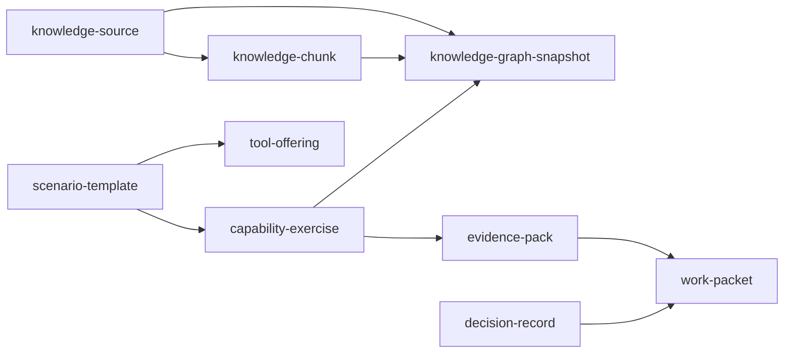

# Middle-Core

`middle-core` is a deployable core (port **8001**, a typed **C#/.NET** minimal API) that sits between `backend-core` provider capabilities and the platform operational APIs. It holds **semantic contracts, scenario definitions, safety policy, evidence expectations, and MCP readiness** — not a storage-shaped CRUD layer.

## Ontology principle
Business objects name **ontology concepts**, not records. The modeling chain:

`persona → goal → use case → activity → phenomenon → ontology concept → business object → provider projection`

## Service layers
- **ArcadeDB capability services** — [[knowledge-source]], [[knowledge-chunk]], [[knowledge-graph-snapshot]]
- **Platform operational services** — [[work-packet]], [[decision-record]], [[evidence-pack]]
- **Meta-services** — [[capability-exercise]], [[tool-offering]], [[scenario-template]]

## Ontology graph

*Visual overview — use the graph view or each note's `[[links]]` to navigate.*

## Scenarios
See [[Scenarios]] — knowledge-drop, semantic-constellation, schema-scout, read-only-query-lab, evidence-pack, agent-route-and-prove.

## Source
- `templates/business-object-catalog.example.json` — the catalog
- `templates/middle-core/` — the C#/.NET service (`GET /catalog`, `/objects`, `/scenarios`)
- `tools/business-object-catalog.mjs` — validate / render CLI
- Docs: `docs/business-object-catalog.md`

## Deployment
`8000` backend-core · **`8001` middle-core** (local `18001`) · `8080` frontend-core.
